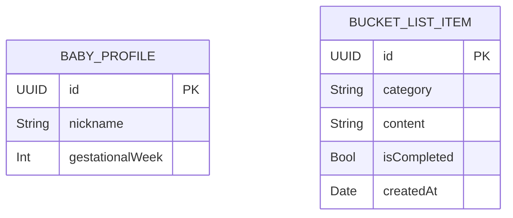

# 태담 공통 데이터 계약

- **상태**: review
- **작성일**: 2026-07-19
- **최종 수정일**: 2026-07-22
- **적용 범위**: 태담, 태담 종류, 태담 진행, 소원 탭이 공통으로 사용하는 데이터와 경계

> 이 문서는 공통 스키마, DTO, 프로토콜과 전체 데이터 흐름의 단일 기준이다. 화면별 동작은 [태담 스펙 인덱스](./taedam-data-contracts.md)에서 해당 기능 문서를 참조한다.

> **코드 확인 기준**: SwiftData 모델, `TaedamRepository`, 번들 대본 로더, `TaedamScreen`, 음성 반응과 버킷리스트 STT는 현재 코드에 구현되어 있다. Home, 대본·생각힌트 미리보기와 준비자세 모달 구현은 아직 없다. 따라서 Figma는 화면 표현 기준으로, 아래 계약은 데이터 필드와 기능 경계 기준으로 사용한다.

> **디자인·콘텐츠 우선순위**: 화면의 레이아웃, 스타일과 컴포넌트 배치는 Figma를 기준으로 한다. 실제 문구, 임신 주차, 소요 시간, 카테고리와 대본 목록은 번들 JSON을 기준으로 하며 Figma와 충돌하면 JSON 값을 표시한다. Home 추천 설명과 추천 대본 연결은 별도의 주차별 Home JSON을 단일 기준으로 사용한다.

## 1. 전체 데이터 원칙

- 정적 대본은 앱 번들 JSON에 두고 현재 구현된 `BundledTaedamScriptLoader.load()`로 읽는다.
- 주차별 Home 헤드라인과 추천 대본 ID는 `home-weekly-content.json`에 두며 대본 본문을 중복 저장하지 않는다.
- 아기 프로필과 사용자가 최종 확정한 버킷리스트만 SwiftData에 저장한다.
- 태담 중 오디오 버퍼, 부분 전사문, RMS·dB 샘플과 모션값은 휘발성으로만 사용하고 저장하지 않는다.
- 하나의 완료된 태담 세션은 `BucketListItem`을 정확히 하나만 생성한다.
- 태담 요약 화면은 SwiftData를 다시 조회하지 않고, 선택한 태담 정보와 사용자가 최종 확정한 한 문장을 직접 전달받아 방금 생성한 버킷리스트 하나만 표시한다.
- 태담 종류 화면은 카테고리가 같은 버킷리스트를, 소원 탭은 전체 버킷리스트를 `@Query`로 관찰한다.

## 2. 전체 플로우

```mermaid
flowchart LR
    HomeJSON[주차별 Home JSON] --> HomeContent[HomeWeeklyContentLoader]
    ScriptJSON[번들 대본 JSON] --> Scripts[BundledTaedamScriptLoader]
    Profile[(BabyProfile)] --> Home[Home<br/>추천·카테고리별 대본]
    HomeContent --> Home
    Scripts --> Home
    Home -->|ScriptSelectionDTO| Preview[대본·생각힌트 미리보기]
    Preview -->|준비하기| Preparation[준비자세 모달]
    Preparation -->|시작하기| Permission[마이크·Speech 권한]
    Permission -->|granted + TaedamSessionInputDTO| Session[태담 진행<br/>3초 카운트다운]
    Mic[마이크 입력] -->|PCM 버퍼| Motion[음성 반응]
    Motion -->|VoiceMotionSampleDTO| Session
    Session -->|마지막 대본 완료| STT[무음 자동 종료<br/>최대 20초 Speech STT]
    Mic -->|PCM 버퍼| STT
    STT -->|BucketListDraftDTO| Keyboard[키보드 텍스트 수정]
    Keyboard -->|SaveBucketListCommandDTO| Repository[TaedamRepository]
    Repository --> Bucket[(BucketListItem)]
    Repository -->|SavedBucketListDTO| Keyboard
    Keyboard -->|주차·제목·이미지·editedText| Summary[태담 요약<br/>버킷리스트 1개]
    Bucket -->|@Query by category| Category[태담 종류]
    Bucket -->|@Query 전체| Wish[소원 탭]
    Wish -->|updateContent/toggleCompletion/delete| Repository
```

마이크 입력에서 SwiftData나 파일 시스템으로 향하는 경로는 존재하지 않는다. STT 결과는 반드시 키보드 편집 단계를 거쳐 사용자가 확정한 문장만 저장한다.

## 3. 주차별 Home JSON 계약

### 저장 위치

```text
Siboya/Resources/Home/home-weekly-content.json
```

### JSON 예시

```json
{
  "weeks": [
    {
      "gestationalWeek": 20,
      "headline": "아빠의 낮은 목소리가 잘 들리는 시기",
      "recommendedScriptID": "57A07A17-20D6-440C-989F-0B1208B6ED01"
    }
  ]
}
```

### 필드 정의

| 경로 | 타입 | 필수 | 설명 |
|---|---|---:|---|
| `weeks` | `[Object]` | O | 20~40주차 Home 콘텐츠 목록 |
| `weeks[].gestationalWeek` | `Int` | O | Home 콘텐츠를 선택할 임신 주차 |
| `weeks[].headline` | `String` | O | 해당 주차의 추천 헤드라인 |
| `weeks[].recommendedScriptID` | `String` (UUID) | O | 추천 카드가 참조할 기존 `scripts[].id` |

- 20~40주차의 헤드라인은 [기획 Notion의 주차별 홈 화면 추천 헤드라인](https://app.notion.com/p/39ffbac165f1804ea1b4ea014eac08f9?source=copy_link)을 원문 기준으로 저장한다.
- 현재 대본이 6개이므로 `recommendedScriptID`는 20주부터 `taedam-scripts.json` 배열 순서대로 6개 기존 UUID를 반복 연결한다.
- 순환은 26주, 32주, 38주에서 첫 번째 대본으로 다시 시작한다. 추후 대본이나 추천 정책이 바뀌면 Home JSON의 ID만 수정한다.
- Home JSON은 대본 제목, 이미지 이름이나 본문을 복제하지 않는다. ID가 있으면 `taedam-scripts.json`에서 해당 대본을 조회한다.
- 대응하는 대본이 없으면 해당 추천 카드만 표시하지 않고 나머지 정상 데이터는 계속 표시한다.
- 번들 정적 데이터의 누락·연결 실패에는 오류 문구, 팝업이나 새로고침 UI를 제공하지 않는다.

### 디코딩 모델

```swift
struct HomeWeeklyContentDocument: Decodable, Sendable {
    let weeks: [HomeWeeklyContent]
}

struct HomeWeeklyContent: Decodable, Sendable {
    let gestationalWeek: Int
    let headline: String
    let recommendedScriptID: UUID
}
```

### 검증 규칙

1. `gestationalWeek`는 `20...40` 범위이며 중복될 수 없다.
2. `headline`은 trim 후 비어 있을 수 없다.
3. `recommendedScriptID`는 유효한 UUID여야 하며 `null`일 수 없다.
4. `recommendedScriptID`와 같은 `scripts[].id`가 `taedam-scripts.json`에 정확히 하나 있어야 한다.
5. 20~40주의 ID 배열은 번들 대본 6개의 ID 배열을 순서대로 반복한 값과 같아야 한다.

## 4. 대본 JSON 계약

### 저장 위치

```text
Siboya/Resources/Scripts/taedam-scripts.json
```

### JSON 예시

```json
{
  "scripts": [
    {
      "id": "8E442B98-7A08-4C67-9A61-E865848F1880",
      "version": 1,
      "category": "집에서 소소하게",
      "title": "일요일 아침 냄새",
      "metadata": {
        "targetGestationalWeek": 20,
        "artworkAssetName": "script_home_sunday_morning_20w",
        "estimatedDurationSeconds": 35
      },
      "sentences": [
        "안녕, {{babyNickname}}아.",
        "아빠야. 오늘 하루도 잘 보냈지?",
        "아빠는 오늘 문득 우리가 함께 맞이할 일요일 아침을 상상해 봤어."
      ],
      "bucketListPrompt": "{{babyNickname}}아, 아빠는 너를 위해 […] 해주고 싶어.",
      "bucketListGuide": "집에서 아이에게 해주고 싶은 사소한 요리나 식사 시간의 모습을 말해보세요."
    }
  ]
}
```

### 필드 정의

| 경로 | 타입 | 필수 | 설명 |
|---|---|---:|---|
| `scripts` | `[Object]` | O | 앱에 포함된 대본 목록 |
| `scripts[].id` | `String` (UUID) | O | 대본 UUID 식별자 |
| `scripts[].version` | `Int` | O | 대본 내용 개정 버전 |
| `scripts[].category` | `String` | O | 대본 카테고리 |
| `scripts[].title` | `String` | O | 개별 대본 제목 |
| `scripts[].metadata.targetGestationalWeek` | `Int` | O | 대본 대상 임신 주차 |
| `scripts[].metadata.artworkAssetName` | `String` | O | 우선 조회할 Assets 이미지 이름. 리소스가 없으면 공통 placeholder 사용 |
| `scripts[].metadata.estimatedDurationSeconds` | `Int` | X | 대본 미리보기에 표시할 예상 소요 시간 |
| `scripts[].sentences` | `[String]` | O | 자동 진행할 일반 대본 문장 |
| `scripts[].bucketListPrompt` | `String` | O | 미리보기의 마지막 빈칸 문장이자 STT 전 플레이스홀더 |
| `scripts[].bucketListGuide` | `String` | O | 미리보기 생각힌트이자 STT 플레이스홀더 직전의 발화 주제 안내 |

- `category`는 여러 대본을 묶는 상위 분류다.
- 일반 대본은 읽는 순서대로 `sentences`에 둔다.
- `bucketListPrompt`는 `sentences`와 섞지 않고 정확히 하나만 둔다.
- 미리보기에서는 `sentences`, `bucketListPrompt`, `bucketListGuide` 순서로 표시한다. `bucketListGuide`만 전구 아이콘을 사용하는 생각힌트 스타일로 표시한다.
- 태담 진행에서는 `bucketListGuide`를 보조 안내 카드로, `bucketListPrompt`를 STT 전 플레이스홀더 문장으로 사용한다.
- 첫 부분 전사문이 들어오면 `bucketListPrompt`를 화면에서 제거하고 전사문으로 대체한다. 두 값 모두 저장 문장에 자동으로 포함하지 않는다.
- `bucketListGuide`에는 예시 답변이나 태담 종료 인사를 넣지 않는다.
- 플레이스홀더 문장 뒤에 이어지는 인사말은 앱 대본에 포함하지 않는다.
- `{{babyNickname}}`은 `TaedamSessionInputDTO`를 만들 때 `BabyProfile.nickname`으로 한 번 치환한다. JSON 원본은 수정하지 않는다.

### 디코딩 모델

```swift
struct TaedamScriptDocument: Decodable, Sendable {
    let scripts: [TaedamScriptContent]
}

struct TaedamScriptContent: Decodable, Sendable {
    let id: UUID
    let version: Int
    let category: String
    let title: String
    let metadata: ScriptMetadataContent
    let sentences: [String]
    let bucketListPrompt: String
    let bucketListGuide: String
}

struct ScriptMetadataContent: Decodable, Sendable {
    let targetGestationalWeek: Int
    let artworkAssetName: String
    let estimatedDurationSeconds: Int?
}
```

### 검증 규칙

1. `script.id`는 유효한 UUID 문자열이어야 한다.
2. `script.id + version` 조합은 중복될 수 없다.
3. `sentences`에는 한 개 이상의 일반 대본 문장이 있어야 한다.
4. 각 문장, `category`, `bucketListPrompt`와 `bucketListGuide`는 trim 후 비어 있을 수 없다.
5. `bucketListPrompt`는 `sentences`에 중복해서 넣지 않는다.
6. `bucketListGuide`에는 `예:` 또는 예시 답변을 포함하지 않는다.
7. `artworkAssetName`은 trim 후 비어 있을 수 없다. 해당 Assets 리소스가 없으면 `script_artwork_placeholder`를 표시하며 JSON 로딩을 실패시키지 않는다.
8. `{{ }}` 형태의 템플릿 변수 중 지원 목록(현재 `babyNickname`)에 없는 값이 있으면 로딩을 실패시킨다. 번들 JSON 유닛 테스트에서도 같은 규칙을 검증한다.

현재 `BundledTaedamScriptLoader`는 JSON 디코딩만 수행한다. 위 1~8 검증을 모두 강제하는 로직은 아직 구현되지 않았으므로 후속 통합 작업에서 보완해야 한다.

Home과 대본·생각힌트 미리보기는 같은 이미지 해석 규칙을 사용한다. `UIImage(named: artworkAssetName)`이 `nil`이면 `script_artwork_placeholder`를 표시한다. `Image(artworkAssetName)`은 리소스 존재 여부를 Optional로 반환하지 않으므로 `??`로 fallback하지 않는다.

## 5. 공통 DTO

### 탐색·대본 선택

```swift
struct TaedamCategorySelectionDTO: Equatable, Sendable {
    let category: String
}

struct ScriptSelectionDTO: Equatable, Sendable {
    let scriptID: UUID
    let scriptVersion: Int
}

struct ScriptSentenceDTO: Identifiable, Equatable, Sendable {
    let index: Int
    let text: String

    var id: Int { index }
}

struct ScriptPreviewDTO: Equatable, Sendable {
    let scriptID: UUID
    let scriptVersion: Int
    let category: String
    let title: String
    let targetGestationalWeek: Int
    let artworkAssetName: String
    let estimatedDurationSeconds: Int?
    let sentences: [ScriptSentenceDTO]
    let bucketListPrompt: String
    let bucketListGuide: String
}

struct BabyProfileDTO: Identifiable, Equatable, Sendable {
    let id: UUID
    let nickname: String
    let gestationalWeek: Int
}
```

- `ScriptPreviewDTO`는 현재 코드에 구현되어 있다.
- `TaedamCategorySelectionDTO`, `ScriptSelectionDTO`와 `BabyProfileDTO`는 Home·미리보기 통합 시 도입할 계약이다.
- 현재 `TaedamRepository.fetchBabyProfile()`은 SwiftData의 `BabyProfile?`을 직접 반환한다.
- View 통합 시 상위 ViewModel·Coordinator가 현재 모델을 표시용 값으로 변환하고 View가 SwiftData 모델을 수정하지 않게 한다.

### 태담 진행

```swift
enum TaedamLineKindDTO: Equatable, Sendable {
    case script(sentenceIndex: Int)
    case bucketList
}

struct TaedamLineDTO: Identifiable, Equatable, Sendable {
    let index: Int
    let kind: TaedamLineKindDTO
    let text: String

    var id: Int { index }
}

struct TaedamSessionInputDTO: Equatable, Sendable {
    let script: ScriptPreviewDTO
    let babyNickname: String
}

enum TaedamScreenPhase: Equatable, Sendable {
    case ready
    case countingDown(remainingSeconds: Int)
    case readingScript(index: Int)
    case bucketList
}

enum TaedamBucketListInputPhase: Equatable, Sendable {
    case idle
    case transcribing
    case finalizing
    case editing
}
```

- `TaedamSessionInputDTO.lines`는 `sentences` 뒤에 `bucketListPrompt`를 사용하는 `.bucketList` 줄을 정확히 하나 추가하는 계산 프로퍼티다.
- `TaedamSessionInputDTO.script`의 문장, `bucketListPrompt`와 `bucketListGuide`는 `babyNickname`이 치환된 값이다.
- `bucketListGuide`는 `.bucketList` 줄 앞의 안내 카드에 표시하고 `bucketListPrompt`는 해당 줄의 플레이스홀더로 표시한다.
- `currentLineProgress`는 `0...1` 범위의 휘발성 화면 값이다.
- STT가 끝나면 `TaedamBucketListInputPhase.editing`으로 전환하며, 사용자가 대본문장을 다시 선택해도 작성 중인 `editedText`를 보존한다.

### 음성·STT DTO

```swift
struct VoiceMotionSampleDTO: Equatable, Sendable {
    let normalizedValue: Double
    let isVoiceActive: Bool
}

struct BucketListDraftDTO: Equatable, Sendable {
    let rawTranscript: String
    var editedText: String
}
```

`VoiceMotionSampleDTO`와 `BucketListDraftDTO`는 현재 코드에 구현되어 있다. `rawTranscript`는 저장하지 않고 사용자가 키보드로 최종 확정한 `editedText`만 저장한다.

### 세션 조정자 설계 DTO

아래 타입은 향후 세션 조정자를 위한 설계 계약이며 아직 코드에 구현되지 않았다.

```swift
enum TaedamSessionPhaseDTO: Equatable, Sendable {
    case ready
    case countingDown(remainingSeconds: Int)
    case readingScript(index: Int)
    case bucketList
    case transcribingBucketList(remainingSeconds: Int)
    case editingBucketList
    case saving
    case completed(bucketListItemID: UUID)
    case failed(message: String)
}

struct TaedamSessionStateDTO: Equatable, Sendable {
    let phase: TaedamSessionPhaseDTO
    let currentLine: TaedamLineDTO?
    let currentLineProgress: Double
    let liveBucketListTranscript: String
    let normalizedVoiceMotion: Double
}
```

- `.bucketList` 줄의 STT 입력 텍스트는 처음에 빈 문자열이며, `bucketListPrompt`는 전사 결과가 생기기 전의 플레이스홀더로만 사용한다.
- 부분 전사문이 들어오면 `bucketListPrompt`를 덮어쓰고 이후 화면에는 전사문만 표시한다.
- `currentLineProgress`와 `normalizedVoiceMotion`은 `0...1` 범위의 휘발성 화면 값이다.
- 재발화 시도를 제공하지 않으므로 STT `attempt`는 상태에 포함하지 않는다.

### 버킷리스트 저장·수정

```swift
struct SaveBucketListCommandDTO: Sendable {
    let category: String
    let content: String
}

struct SavedBucketListDTO: Sendable {
    let bucketListItemID: UUID
}

struct UpdateBucketListContentCommandDTO: Sendable {
    let bucketListItemID: UUID
    let content: String
}
```

## 6. SwiftData 스키마



### `BabyProfile`

| 필드 | 타입 | 설명 |
|---|---|---|
| `id` | `UUID` | unique |
| `nickname` | `String` | trim 후 빈 문자열 금지 |
| `gestationalWeek` | `Int` | 현재 임신 주차 |

### `BucketListItem`

| 필드 | 타입 | 설명 |
|---|---|---|
| `id` | `UUID` | unique |
| `category` | `String` | 버킷리스트가 생성된 대본의 카테고리 스냅샷 |
| `content` | `String` | 사용자가 키보드로 수정·확정한 문장 |
| `isCompleted` | `Bool` | 수행 여부, 생성 시 `false` |
| `createdAt` | `Date` | 생성 시각 |

`BucketListItem`은 녹음 기록과 연결되지 않는다. `category`는 생성 후 수정하지 않는다.

### 현재 SwiftData 모델

```swift
import Foundation
import SwiftData

@Model
final class BabyProfile {
    @Attribute(.unique) var id: UUID
    private(set) var nickname: String
    var gestationalWeek: Int

    init(
        id: UUID = UUID(),
        nickname: String,
        gestationalWeek: Int
    ) {
        self.id = id
        self.nickname = nickname
        self.gestationalWeek = gestationalWeek
    }

    func updateNickname(_ newNickname: String) {
        nickname = newNickname
    }
}

@Model
final class BucketListItem {
    @Attribute(.unique) var id: UUID
    private(set) var category: String
    private(set) var content: String
    private(set) var isCompleted: Bool
    var createdAt: Date

    init(
        id: UUID = UUID(),
        category: String,
        content: String,
        isCompleted: Bool = false,
        createdAt: Date = .now
    ) {
        self.id = id
        self.category = category
        self.content = content
        self.isCompleted = isCompleted
        self.createdAt = createdAt
    }

    func updateContent(_ newContent: String) {
        content = newContent
    }

    func toggleCompletion() {
        isCompleted.toggle()
    }
}
```

- `nickname`, `category`, `content`, `isCompleted`는 `private(set)`으로 제한하고 각 모델의 메서드(`updateNickname`, `updateContent`, `toggleCompletion`)를 통해서만 변경한다. `@Query`가 View에 살아있는 모델 레퍼런스를 직접 주기 때문에 Repository를 거치지 않은 직접 대입을 막기 위한 장치다.
- 앱 루트의 `SiboyaApp`이 `PersistenceContainer.shared`를 `.modelContainer(...)`로 주입한다.
- `SwiftDataTaedamRepository`는 전달받은 `ModelContext`를 사용하며 메인 액터에서 호출해야 한다.

## 7. 공통 프로토콜

`TaedamRepository`, `VoiceMotionMonitoring`, `BucketListTranscribing`은 현재 코드에 구현되어 있다. `ScriptRepository`와 `TaedamScriptProgressing`은 Home·미리보기 통합을 위한 설계 계약이며 아직 구현되지 않았다. 번들 대본은 현재 `BundledTaedamScriptLoader`의 정적 메서드가 직접 로드한다.

```swift
protocol ScriptRepository: Sendable {
    func fetchScripts() async throws -> [ScriptPreviewDTO]
    func fetchScript(
        selection: ScriptSelectionDTO
    ) async throws -> ScriptPreviewDTO
}

protocol TaedamScriptProgressing: Sendable {
    var states: AsyncStream<TaedamSessionStateDTO> { get }

    func prepare(input: TaedamSessionInputDTO) async
    func start() async
    func selectLine(at index: Int) async throws
    func cancel() async
}

protocol VoiceMotionMonitoring: Sendable {
    var samples: AsyncStream<VoiceMotionSampleDTO> { get }

    func startMonitoring() async throws
    func stopMonitoring() async
}

enum BucketListTranscriptionEndReason: Equatable, Sendable {
    case silence
    case maximumDuration
    case recognitionFinalized
    case recognitionFailed
}

protocol BucketListTranscribing: Sendable {
    var partialTranscripts: AsyncStream<String> { get }
    var automaticEndEvents: AsyncStream<BucketListTranscriptionEndReason> { get }
    var voiceMotionSamples: AsyncStream<VoiceMotionSampleDTO> { get }

    func start(duration: Duration) async throws
    func finish() async throws -> BucketListDraftDTO
    func cancel() async
}

protocol TaedamRepository: Sendable {
    func fetchBabyProfile() throws -> BabyProfile?
    func ensureBabyProfile(
        nickname: String,
        gestationalWeek: Int
    ) async throws
    func updateNickname(_ nickname: String) async throws
    func save(
        command: SaveBucketListCommandDTO
    ) async throws -> SavedBucketListDTO
    func updateContent(
        command: UpdateBucketListContentCommandDTO
    ) async throws
    func toggleCompletion(bucketListItemID: UUID) async throws
    func delete(bucketListItemID: UUID) async throws
}
```

- `ScriptRepository`는 Home·미리보기 통합 시 도입할 경계다. 현재 View에서 이 타입을 참조하면 컴파일되지 않는다.
- `TaedamRepository`는 SwiftData 변경을 담당한다. `fetchBabyProfile()`은 현재 `BabyProfile?`을 직접 반환한다.
- View는 SwiftData 저장 모델을 직접 수정하지 않는다. 표시용 조회는 `@Query`를 사용할 수 있지만 저장·수정·완료 토글·삭제는 ViewModel 또는 상위 조정자가 `TaedamRepository`를 호출한다.
- `toggleCompletion`은 화면이 계산한 값을 받지 않고 저장된 최신 `isCompleted`를 Repository 내부에서 뒤집는다.
- `ensureBabyProfile`은 멱등적이다. 이미 `BabyProfile`이 있으면 아무 것도 하지 않고 없을 때만 생성한다. 온보딩 화면이 없는 MVP 단계에서는 앱 최초 진입 시 임시로 호출해 하나만 만들어 둔다.
- `ensureBabyProfile`은 프로필이 없어서 생성할 때만 `nickname`을 trim·검증하며 trim 후 빈 문자열이면 실패한다. `updateNickname`은 항상 trim 후 빈 문자열이면 실패한다.

## 8. 저장·수정 불변 조건

1. `category`는 `TaedamSessionInputDTO.script.category`에서 가져오며 trim 후 비어 있을 수 없다.
2. `category`는 `BucketListItem` 생성 후 수정하지 않는다.
3. `content`는 `save`와 `updateContent` 모두에서 trim 후 비어 있을 수 없다.
4. `save`는 STT 원문이 아니라 사용자가 키보드로 수정·확정한 문장을 저장한다.
5. 새 항목은 `isCompleted == false`로 저장한다.
6. 세션 조정자는 저장 성공 후 즉시 `.completed(bucketListItemID:)`로 전환하고 추가 `save` 요청을 받지 않는다.
7. 부분 전사문, 오디오 데이터와 모션 샘플은 저장 명령에 포함하지 않는다.
