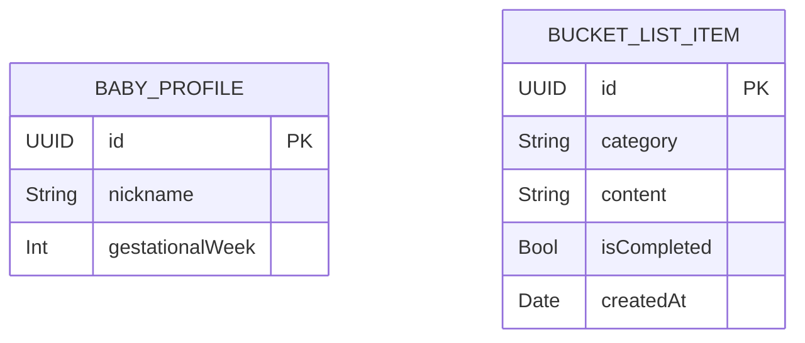

# 태담 공통 데이터 계약

- **상태**: review
- **작성일**: 2026-07-19
- **최종 수정일**: 2026-07-21
- **적용 범위**: 태담, 태담 종류, 태담 진행, 소원 탭이 공통으로 사용하는 데이터와 경계

> 이 문서는 공통 스키마, DTO, 프로토콜과 전체 데이터 흐름의 단일 기준이다. 화면별 동작은 [태담 스펙 인덱스](./taedam-data-contracts.md)에서 해당 기능 문서를 참조한다.

## 1. 전체 데이터 원칙

- 정적 대본은 앱 번들 JSON에 두고 `ScriptRepository`로 읽는다.
- 아기 프로필과 사용자가 최종 확정한 버킷리스트만 SwiftData에 저장한다.
- 태담 중 오디오 버퍼, 부분 전사문, RMS·dB 샘플과 모션값은 휘발성으로만 사용하고 저장하지 않는다.
- 하나의 완료된 태담 세션은 `BucketListItem`을 정확히 하나만 생성한다.
- 태담 요약 화면은 방금 생성한 버킷리스트 하나만 표시한다.
- 태담 종류 화면은 카테고리가 같은 버킷리스트를, 소원 탭은 전체 버킷리스트를 `@Query`로 관찰한다.

## 2. 전체 플로우

```mermaid
flowchart LR
    JSON[번들 대본 JSON] --> Scripts[ScriptRepository]
    Scripts --> Taedam[태담<br/>카테고리별 모아보기]
    Taedam -->|TaedamCategorySelectionDTO| Category[태담 종류]
    Category -->|ScriptSelectionDTO| Preview[대본 미리보기]
    Preview -->|TaedamSessionInputDTO| Session[태담 진행]
    Mic[마이크 입력] -->|PCM 버퍼| Motion[음성 반응]
    Motion -->|VoiceMotionSampleDTO| Session
    Session -->|마지막 대본 완료| STT[20초 Speech STT]
    Mic -->|PCM 버퍼| STT
    STT -->|BucketListDraftDTO| Keyboard[키보드 텍스트 수정]
    Keyboard -->|SaveBucketListCommandDTO| Repository[TaedamRepository]
    Repository --> Bucket[(BucketListItem)]
    Repository -->|SavedBucketListDTO| Summary[태담 요약<br/>버킷리스트 1개]
    Bucket -->|@Query by id| Summary
    Bucket -->|@Query by category| Category
    Bucket -->|@Query 전체| Wish[소원 탭]
    Wish -->|updateContent/toggleCompletion/delete| Repository
```

마이크 입력에서 SwiftData나 파일 시스템으로 향하는 경로는 존재하지 않는다. STT 결과는 반드시 키보드 편집 단계를 거쳐 사용자가 확정한 문장만 저장한다.

## 3. 대본 JSON 계약

### 저장 위치

```text
Siboya/Resources/Scripts/taedam-scripts.json
```

### JSON 예시

```json
{
  "scripts": [
    {
      "id": "8E442B98-7A08-4C67-9A61-E865848F1880",
      "version": 1,
      "category": "아기사랑",
      "title": "상상력을 자극하는 이야기",
      "subtitle": "아빠의 목소리로 상상하는 첫 여행",
      "metadata": {
        "targetGestationalWeek": 22,
        "artworkAssetName": "script_baby_love_imagination_22w",
        "estimatedDurationSeconds": 180
      },
      "sentences": [
        "{{babyNickname}}아, 오늘도 엄마와 너를 생각했어.",
        "아빠와 함께 푹신한 구름 위로 올라가 보자.",
        "구름 아래에는 반짝이는 바다와 초록 숲이 보여.",
        "언젠가 우리 셋이 함께 이 풍경을 보러 가자."
      ],
      "bucketListPrompt": "{{babyNickname}}와 함께하고 싶은 일을 자유롭게 이야기해 주세요."
    }
  ]
}
```

### 필드 정의

| 경로 | 타입 | 필수 | 설명 |
|---|---|---:|---|
| `scripts` | `[Object]` | O | 앱에 포함된 대본 목록 |
| `scripts[].id` | `String` (UUID) | O | 대본 UUID 식별자 |
| `scripts[].version` | `Int` | O | 대본 내용 개정 버전 |
| `scripts[].category` | `String` | O | 대본 카테고리 |
| `scripts[].title` | `String` | O | 개별 대본 제목 |
| `scripts[].subtitle` | `String` | O | 대본 한 줄 설명 |
| `scripts[].metadata.targetGestationalWeek` | `Int` | O | 대본 대상 임신 주차 |
| `scripts[].metadata.artworkAssetName` | `String` | O | Assets 이미지 이름 |
| `scripts[].metadata.estimatedDurationSeconds` | `Int` | X | 대본 미리보기에 표시할 예상 소요 시간 |
| `scripts[].sentences` | `[String]` | O | 자동 진행할 일반 대본 문장 |
| `scripts[].bucketListPrompt` | `String` | O | 대본 마지막에 한 번만 사용할 자유 발화 안내 |

- `category`는 여러 대본을 묶는 상위 분류다.
- 일반 대본은 읽는 순서대로 `sentences`에 둔다.
- `bucketListPrompt`는 `sentences`와 섞지 않고 정확히 하나만 둔다.
- `{{babyNickname}}`은 `TaedamSessionInputDTO`를 만들 때 `BabyProfile.nickname`으로 한 번 치환한다. JSON 원본은 수정하지 않는다.

### 디코딩 모델

```swift
struct TaedamScriptDocument: Decodable, Sendable {
    let scripts: [TaedamScriptContent]
}

struct TaedamScriptContent: Decodable, Sendable {
    let id: UUID
    let version: Int
    let category: String
    let title: String
    let subtitle: String
    let metadata: ScriptMetadataContent
    let sentences: [String]
    let bucketListPrompt: String
}

struct ScriptMetadataContent: Decodable, Sendable {
    let targetGestationalWeek: Int
    let artworkAssetName: String
    let estimatedDurationSeconds: Int?
}
```

### 검증 규칙

1. `script.id`는 유효한 UUID 문자열이어야 한다.
2. `script.id + version` 조합은 중복될 수 없다.
3. `sentences`에는 한 개 이상의 일반 대본 문장이 있어야 한다.
4. 각 문장, `category`와 `bucketListPrompt`는 trim 후 비어 있을 수 없다.
5. `bucketListPrompt`는 `sentences`에 중복해서 넣지 않는다.
6. `artworkAssetName`은 실제 Assets 리소스와 일치해야 한다.
7. `{{ }}` 형태의 템플릿 변수 중 지원 목록(현재 `babyNickname`)에 없는 값이 있으면 로딩을 실패시킨다. 번들 JSON 유닛 테스트에서도 같은 규칙을 검증한다.

## 4. 공통 DTO

### 탐색·대본 선택

```swift
struct TaedamCategorySelectionDTO: Equatable, Sendable {
    let category: String
}

struct ScriptSelectionDTO: Equatable, Sendable {
    let scriptID: UUID
    let scriptVersion: Int
}

struct ScriptSentenceDTO: Identifiable, Equatable, Sendable {
    let index: Int
    let text: String

    var id: Int { index }
}

struct ScriptPreviewDTO: Sendable {
    let scriptID: UUID
    let scriptVersion: Int
    let category: String
    let title: String
    let subtitle: String
    let targetGestationalWeek: Int
    let artworkAssetName: String
    let estimatedDurationSeconds: Int?
    let sentences: [ScriptSentenceDTO]
    let bucketListPrompt: String
}

struct BabyProfileDTO: Identifiable, Equatable, Sendable {
    let id: UUID
    let nickname: String
    let gestationalWeek: Int
}
```

### 태담 진행

```swift
enum TaedamLineKindDTO: Equatable, Sendable {
    case script(sentenceIndex: Int)
    case bucketList
}

struct TaedamLineDTO: Identifiable, Equatable, Sendable {
    let index: Int
    let kind: TaedamLineKindDTO
    let text: String

    var id: Int { index }
}

struct TaedamSessionInputDTO: Sendable {
    let script: ScriptPreviewDTO
    let babyNickname: String
}

enum TaedamPhaseDTO: Equatable, Sendable {
    case ready
    case countingDown(remainingSeconds: Int)
    case readingScript(index: Int)
    case transcribingBucketList(remainingSeconds: Int)
    case reviewingBucketListDraft
    case editingBucketList
    case saving
    case completed(bucketListItemID: UUID)
    case failed(message: String)
}

struct TaedamSessionStateDTO: Equatable, Sendable {
    let phase: TaedamPhaseDTO
    let currentLine: TaedamLineDTO?
    let currentLineProgress: Double
    let liveBucketListTranscript: String
    let normalizedVoiceMotion: Double
}

struct VoiceMotionSampleDTO: Equatable, Sendable {
    let normalizedValue: Double
    let isVoiceActive: Bool
}

struct BucketListDraftDTO: Equatable, Sendable {
    let rawTranscript: String
    var editedText: String
}
```

- `TaedamSessionInputDTO.script`의 문장과 `bucketListPrompt`는 `babyNickname`이 치환된 값이다.
- 세션은 일반 문장 뒤에 `.bucketList` 줄을 정확히 하나만 추가한다.
- `.bucketList` 줄의 입력 텍스트는 처음에 빈 문자열이며, `bucketListPrompt`는 안내 문구로만 사용한다.
- `currentLineProgress`와 `normalizedVoiceMotion`은 `0...1` 범위의 휘발성 화면 값이다.
- 재발화 시도를 제공하지 않으므로 STT `attempt`는 상태에 포함하지 않는다.

### 버킷리스트 저장·수정

```swift
struct SaveBucketListCommandDTO: Sendable {
    let category: String
    let content: String
}

struct SavedBucketListDTO: Sendable {
    let bucketListItemID: UUID
}

struct UpdateBucketListContentCommandDTO: Sendable {
    let bucketListItemID: UUID
    let content: String
}
```

## 5. SwiftData 스키마



### `BabyProfile`

| 필드 | 타입 | 설명 |
|---|---|---|
| `id` | `UUID` | unique |
| `nickname` | `String` | trim 후 빈 문자열 금지 |
| `gestationalWeek` | `Int` | 현재 임신 주차 |

### `BucketListItem`

| 필드 | 타입 | 설명 |
|---|---|---|
| `id` | `UUID` | unique |
| `category` | `String` | 버킷리스트가 생성된 대본의 카테고리 스냅샷 |
| `content` | `String` | 사용자가 키보드로 수정·확정한 문장 |
| `isCompleted` | `Bool` | 수행 여부, 생성 시 `false` |
| `createdAt` | `Date` | 생성 시각 |

`BucketListItem`은 녹음 기록과 연결되지 않는다. `category`는 생성 후 수정하지 않는다.

### SwiftData 모델 초안

```swift
import Foundation
import SwiftData

@Model
final class BabyProfile {
    @Attribute(.unique) var id: UUID
    var nickname: String
    var gestationalWeek: Int

    init(
        id: UUID = UUID(),
        nickname: String,
        gestationalWeek: Int
    ) {
        self.id = id
        self.nickname = nickname
        self.gestationalWeek = gestationalWeek
    }
}

@Model
final class BucketListItem {
    @Attribute(.unique) var id: UUID
    var category: String
    var content: String
    var isCompleted: Bool
    var createdAt: Date

    init(
        id: UUID = UUID(),
        category: String,
        content: String,
        isCompleted: Bool = false,
        createdAt: Date = .now
    ) {
        self.id = id
        self.category = category
        self.content = content
        self.isCompleted = isCompleted
        self.createdAt = createdAt
    }
}
```

## 6. 공통 프로토콜

```swift
protocol ScriptRepository: Sendable {
    func fetchScripts() async throws -> [ScriptPreviewDTO]
    func fetchScript(selection: ScriptSelectionDTO) async throws -> ScriptPreviewDTO
}

protocol TaedamScriptProgressing: Sendable {
    var states: AsyncStream<TaedamSessionStateDTO> { get }

    func prepare(input: TaedamSessionInputDTO) async
    func start() async
    func selectLine(at index: Int) async throws
    func beginEditingBucketListDraft() async throws
    func cancel() async
}

protocol VoiceMotionMonitoring: Sendable {
    var samples: AsyncStream<VoiceMotionSampleDTO> { get }

    func startMonitoring() async throws
    func stopMonitoring() async
}

protocol BucketListTranscribing: Sendable {
    var partialTranscripts: AsyncStream<String> { get }

    func start(duration: Duration) async throws
    func finish() async throws -> BucketListDraftDTO
    func cancel() async
}

protocol TaedamRepository: Sendable {
    func fetchBabyProfile() throws -> BabyProfile?
    func save(command: SaveBucketListCommandDTO) async throws -> SavedBucketListDTO
    func updateContent(
        command: UpdateBucketListContentCommandDTO
    ) async throws
    func toggleCompletion(bucketListItemID: UUID) async throws
    func delete(bucketListItemID: UUID) async throws
}
```

- `ScriptRepository`는 번들 JSON을 로드·검증하지만 JSON 원본을 수정하지 않는다.
- `TaedamRepository`는 SwiftData 변경을 담당한다. 화면의 반응형 조회는 `@Query`를 직접 사용한다.
- `toggleCompletion`은 화면이 계산한 값을 받지 않고, 저장된 최신 `isCompleted`를 Repository 내부에서 뒤집는다.

## 7. 저장·수정 불변 조건

1. `category`는 `TaedamSessionInputDTO.script.category`에서 가져오며 trim 후 비어 있을 수 없다.
2. `category`는 `BucketListItem` 생성 후 수정하지 않는다.
3. `content`는 `save`와 `updateContent` 모두에서 trim 후 비어 있을 수 없다.
4. `save`는 STT 원문이 아니라 사용자가 키보드로 수정·확정한 문장을 저장한다.
5. 새 항목은 `isCompleted == false`로 저장한다.
6. 세션 조정자는 저장 성공 후 즉시 `.completed(bucketListItemID:)`로 전환하고 추가 `save` 요청을 받지 않는다.
7. 부분 전사문, 오디오 데이터와 모션 샘플은 저장 명령에 포함하지 않는다.
