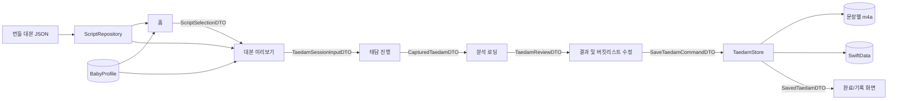
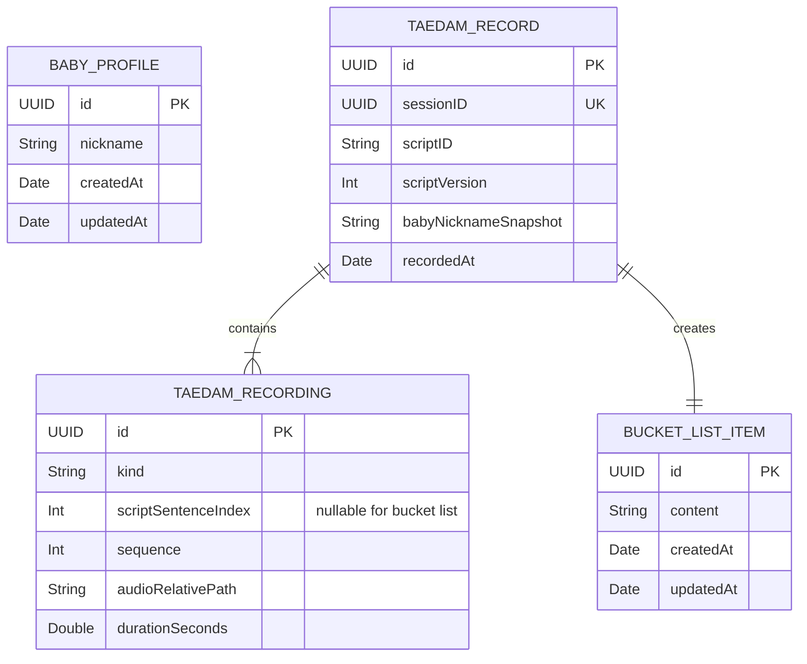
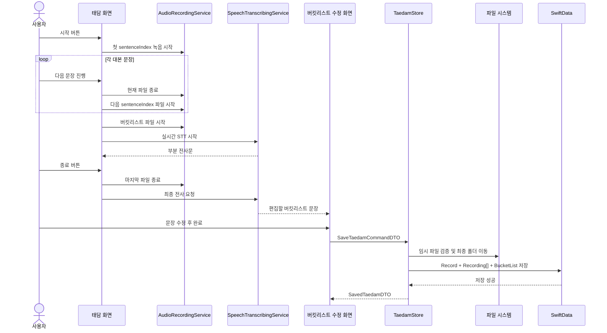

# 태담 정적 대본·화면 데이터 흐름·SwiftData 스키마

- **상태**: review
- **작성일**: 2026-07-16
- **관련 백로그**: [`../backlog/taedam-recording.md`](../backlog/taedam-recording.md)
- **적용 범위**: 홈 → 대본 미리보기 → 태담 진행 → 분석 로딩 → 버킷리스트 수정 → 저장

> 이 문서는 태담 기능을 함께 개발할 때 사용하는 데이터 계약의 단일 기준이다.
> 화면 구현은 이 문서의 DTO를 기준으로 연결하고, 정적 대본은 JSON, 사용자 생성 데이터는 SwiftData와 파일 시스템에 저장한다.

## 1. 확정된 저장 원칙

| 데이터 | 저장 위치 | 이유 |
|---|---|---|
| 대본 종류·메타데이터·문장 | 앱 번들 JSON | 앱과 함께 배포되는 읽기 전용 콘텐츠 |
| 아기의 현재 태명 | SwiftData `BabyProfile` | 사용자가 입력·수정하는 데이터 |
| 태담 기록과 JSON 대본 참조 | SwiftData `TaedamRecord` | 한 번의 태담 세션을 식별하기 위해 필요 |
| 대본 문장별 녹음 정보 | SwiftData `TaedamRecording` | JSON 문장과 실제 오디오 파일을 연결 |
| 버킷리스트 최종 문장 | SwiftData `BucketListItem` | STT 결과를 사용자가 수정·확정한 데이터 |
| 실제 녹음 파일 | Application Support | 큰 바이너리를 DB에 넣지 않기 위함 |

핵심 연결 키는 다음과 같다.

```text
JSON scripts[].id + scripts[].version
                    │
                    └── SwiftData TaedamRecord.scriptID + scriptVersion

JSON scripts[].sentences[index]
                    │
                    └── SwiftData TaedamRecording.scriptSentenceIndex
```

- 화면은 JSON 디코딩 모델이나 SwiftData `@Model` 객체를 직접 주고받지 않는다.
- 화면 사이에서는 값 타입인 `Sendable DTO`만 전달한다.
- 문장 배열의 인덱스는 해당 대본 버전 안에서 녹음 데이터의 외래 참조 역할을 한다.
- 문장을 추가·삭제·재정렬·수정하면 기존 배열을 덮어쓰지 않고 대본 `version`을 올린다.
- 버킷리스트 음성은 특정 대본 문장에 대응하지 않는다. 같은 `TaedamRecord`에 `kind = bucketList`인 별도 녹음으로 연결한다.
- 현재 저장 범위에는 개별 dB 샘플과 실시간 부분 전사문을 포함하지 않는다. 이 값은 화면 표시와 최종 문장 생성에만 사용한다.

---

## 2. 최종 대본 JSON 형식

- `category`는 여러 대본을 묶는 상위 분류다. 이 대본의 카테고리는 `아기사랑`이다.
- `title`은 개별 대본의 제목이다. 이 대본의 제목은 `상상력을 자극하는 이야기`다.
- `sentences`는 문장 객체 배열이 아니라 읽는 순서대로 구성된 `[String]`이다.
- 문장별 녹음은 별도 문장 ID 대신 `scriptID + scriptVersion + sentenceIndex`로 매핑한다.

### 파일 위치

```text
Siboya/Resources/Scripts/taedam-scripts.json
```

### 전체 예시

```json
{
  "schemaVersion": 1,
  "scripts": [
    {
      "id": "baby-love-imagination-22w",
      "version": 1,
      "category": "아기사랑",
      "title": "상상력을 자극하는 이야기",
      "subtitle": "아빠의 목소리로 상상하는 첫 여행",
      "metadata": {
        "gestationalWeek": 22,
        "artworkAssetName": "script_baby_love_imagination_22w",
        "estimatedDurationSeconds": 180
      },
      "sentences": [
        "{{babyNickname}}아, 오늘도 엄마와 너를 생각했어.",
        "아빠와 함께 푹신한 구름 위로 올라가 보자.",
        "구름 아래에는 반짝이는 바다와 초록 숲이 보여.",
        "언젠가 우리 셋이 함께 이 풍경을 보러 가자."
      ],
      "bucketListPrompt": "{{babyNickname}}와 함께하고 싶은 일을 자유롭게 이야기해 주세요."
    }
  ]
}
```

### 필드 정의

| 경로 | 타입 | 필수 | 설명 |
|---|---|---:|---|
| `schemaVersion` | `Int` | O | JSON 문서 구조 버전 |
| `scripts` | `Array` | O | 앱에 포함된 전체 대본 |
| `scripts[].id` | `String` | O | 대본의 영구 식별자 |
| `scripts[].version` | `Int` | O | 같은 대본 내용의 개정 버전 |
| `category` | `String` | O | 대본 카테고리. 예: `아기사랑` |
| `title` | `String` | O | 대본 제목 |
| `subtitle` | `String` | O | 대본 한 줄 설명 |
| `metadata.gestationalWeek` | `Int` | O | 대본이 대상으로 하는 임신 주차 |
| `metadata.artworkAssetName` | `String` | O | Assets 이미지 이름 |
| `metadata.estimatedDurationSeconds` | `Int` | X | 예상 소요 시간(표시용) |
| `sentences` | `[String]` | O | 읽는 순서대로 들어 있는 문장 더미 |
| `sentences[index]` | `String` | O | 화면에 표시할 문장 템플릿. 배열 인덱스로 녹음과 연결 |
| `bucketListPrompt` | `String` | O | 자유 발화를 유도하는 문장 템플릿 |

`{{babyNickname}}`은 현재 지원하는 유일한 템플릿 변수다. 화면용 DTO를 만들 때 `BabyProfile.nickname`으로 치환한다. JSON 원본은 치환하지 않는다.

### Swift 디코딩 모델

```swift
struct TaedamScriptDocument: Decodable, Sendable {
    let schemaVersion: Int
    let scripts: [TaedamScriptContent]
}

struct TaedamScriptContent: Decodable, Sendable {
    let id: String
    let version: Int
    let category: String
    let title: String
    let subtitle: String
    let metadata: ScriptMetadataContent
    let sentences: [String]
    let bucketListPrompt: String
}

struct ScriptMetadataContent: Decodable, Sendable {
    let gestationalWeek: Int
    let artworkAssetName: String
    let estimatedDurationSeconds: Int?
}

```

### JSON 검증 규칙

1. 앱이 지원하지 않는 `schemaVersion`이면 전체 로딩을 실패시킨다.
2. `script.id + version` 조합은 중복될 수 없다.
3. `sentences`는 한 개 이상이어야 한다.
4. `sentences`의 각 문자열은 trim 후 비어 있을 수 없다.
5. 배열 순서가 곧 문장 순서이므로 별도의 `order` 필드를 두지 않는다.
6. `artworkAssetName`은 실제 Assets 리소스와 일치해야 한다.
7. 지원하지 않는 `{{...}}` 템플릿 변수가 있으면 테스트를 실패시킨다.
8. 배포된 대본 문장을 변경하면 기존 버전을 수정하지 않고 새 `version`을 추가한다. 과거 기록 조회에 필요한 버전은 JSON에서 제거하지 않는다.
9. 카운트다운이나 자동 진행 시간을 뜻하는 필드는 두지 않는다. 녹음 시작과 종료는 사용자의 버튼 입력으로만 처리한다.

---

## 3. 화면별 데이터 전달 구조

### 전체 흐름



### 공통 화면 DTO

```swift
struct ScriptSelectionDTO: Sendable {
    let scriptID: String
    let scriptVersion: Int
}

struct ScriptSentenceDTO: Identifiable, Equatable, Sendable {
    let index: Int
    let text: String

    var id: Int { index }
}

struct ScriptPreviewDTO: Sendable {
    let scriptID: String
    let scriptVersion: Int
    let category: String
    let title: String
    let subtitle: String
    let gestationalWeek: Int
    let artworkAssetName: String
    let estimatedDurationSeconds: Int?
    let sentences: [ScriptSentenceDTO]
    let bucketListPrompt: String
}

struct TaedamSessionInputDTO: Sendable {
    let sessionID: UUID
    let script: ScriptPreviewDTO
    let babyNickname: String
}
```

`ScriptSentenceDTO.text`와 `bucketListPrompt`에는 이미 태명이 치환되어 있다. 태담 진행 화면은 JSON이나 `BabyProfile`을 다시 조회하지 않는다.

### 화면별 입출력

| 화면 | 받는 데이터 | 화면 내부에서 사용하는 데이터 | 다음 화면으로 보내는 데이터 |
|---|---|---|---|
| 홈 | 없음 | `BabyProfileDTO`, `[ScriptCardDTO]`, 최근 기록 | 선택한 `ScriptSelectionDTO` |
| 대본 미리보기 | `ScriptSelectionDTO` | `ScriptPreviewDTO`, 마이크·Speech 권한 상태 | `TaedamSessionInputDTO` |
| 태담 시작 대기 | `TaedamSessionInputDTO` | 제목, 태명, 문장 목록, 시작 가능 상태 | 별도 DTO 없음. 시작 이벤트만 세션에 전달 |
| 태담 진행 | `TaedamSessionInputDTO` | 현재 문장, 녹음 상태, dB 레벨, 버킷리스트 실시간 전사 | 종료 시 `CapturedTaedamDTO` |
| 분석 로딩 | `CapturedTaedamDTO` | 파일 검증 상태, 최종 STT 문장 | `TaedamReviewDTO` |
| 버킷리스트 수정 | `TaedamReviewDTO` | 편집 가능한 `editedBucketListText` | `SaveTaedamCommandDTO` |
| 완료·기록 | `SavedTaedamDTO` 또는 `recordID` | 저장된 태담·버킷리스트 조회 DTO | 상위 화면에 완료 이벤트 |

### 3.1 홈

```swift
struct BabyProfileDTO: Sendable {
    let id: UUID
    let nickname: String
}

struct ScriptCardDTO: Identifiable, Sendable {
    let id: String
    let version: Int
    let category: String
    let title: String
    let gestationalWeek: Int
    let artworkAssetName: String
}

struct HomeDTO: Sendable {
    let baby: BabyProfileDTO
    let scripts: [ScriptCardDTO]
}
```

```swift
protocol HomeUseCase: Sendable {
    func loadHome() async throws -> HomeDTO
}
```

### 3.2 대본 미리보기

```swift
protocol ScriptPreviewUseCase: Sendable {
    func loadPreview(selection: ScriptSelectionDTO) async throws -> ScriptPreviewDTO
    func makeSessionInput(from preview: ScriptPreviewDTO) async throws -> TaedamSessionInputDTO
}
```

- `loadPreview`는 JSON 대본을 읽고 현재 태명을 문장 템플릿에 치환한다.
- 시작 버튼을 누르면 새 `sessionID`를 만들어 태담 화면으로 전달한다.

### 3.3 태담 진행

```swift
enum RecordingSourceDTO: Equatable, Sendable {
    case scriptSentence(index: Int)
    case bucketList
}

enum TaedamPhaseDTO: Equatable, Sendable {
    case ready
    case recordingScript(index: Int)
    case recordingBucketList
    case paused
    case finishing
    case failed(message: String)
}

struct TaedamSessionStateDTO: Equatable, Sendable {
    let phase: TaedamPhaseDTO
    let currentSentence: ScriptSentenceDTO?
    let liveBucketListTranscript: String
    let normalizedAudioLevel: Double
}

struct CapturedRecordingDTO: Sendable {
    let id: UUID
    let source: RecordingSourceDTO
    let temporaryFileURL: URL
    let durationSeconds: Double
}

struct CapturedTaedamDTO: Sendable {
    let sessionID: UUID
    let scriptID: String
    let scriptVersion: Int
    let babyNickname: String
    let recordedAt: Date
    let recordings: [CapturedRecordingDTO]
    let rawBucketListTranscript: String
}
```

```swift
protocol TaedamSessionUseCase: Sendable {
    var states: AsyncStream<TaedamSessionStateDTO> { get }

    func prepare(input: TaedamSessionInputDTO) async
    func start() async throws
    func moveToNextSentence() async throws
    func beginBucketList() async throws
    func pause() async throws
    func resume() async throws
    func finish() async throws -> CapturedTaedamDTO
    func cancel() async
}
```

- 화면 진입만으로 녹음하지 않는다. 사용자가 시작 버튼을 누르면 첫 문장 녹음을 시작한다.
- 문장이 바뀔 때 현재 파일을 닫고 다음 `sentence.index`에 해당하는 파일을 시작한다.
- 버킷리스트 구간에서는 별도 녹음 파일과 Speech 실시간 전사를 함께 진행한다.
- 3, 2, 1 카운트다운은 없다.
- 사용자가 종료 버튼을 누르기 전에는 세션을 자동으로 종료하지 않는다.

### 3.4 분석 로딩

```swift
struct TaedamReviewDTO: Sendable {
    let captured: CapturedTaedamDTO
    let initialBucketListText: String
}

protocol TaedamProcessingUseCase: Sendable {
    func prepareReview(from captured: CapturedTaedamDTO) async throws -> TaedamReviewDTO
}
```

- 모든 JSON 문장에 대응하는 녹음이 있는지 검사한다.
- 녹음 파일이 재생 가능한지 검사한다.
- STT 최종 결과의 앞뒤 공백을 정리해 `initialBucketListText`로 전달한다.
- 원본 부분 전사 이벤트는 저장하지 않는다.

### 3.5 버킷리스트 수정·저장

```swift
struct SaveTaedamCommandDTO: Sendable {
    let captured: CapturedTaedamDTO
    let confirmedBucketListText: String
}

struct SavedTaedamDTO: Sendable {
    let recordID: UUID
    let bucketListItemID: UUID
}

protocol TaedamReviewUseCase: Sendable {
    func save(command: SaveTaedamCommandDTO) async throws -> SavedTaedamDTO
}
```

- 화면은 `initialBucketListText`를 편집 가능한 상태로 복사한다.
- 사용자가 수정한 최종 문자열만 `confirmedBucketListText`로 보낸다.
- 공백만 있는 버킷리스트는 저장하지 않는다.
- 저장 성공 전에는 임시 녹음 파일을 최종 기록으로 취급하지 않는다.

---

## 4. SwiftData 스키마

### 관계 시각화



`BabyProfile`은 현재 태명을 관리하는 독립 데이터다. `TaedamRecord.babyNicknameSnapshot`은 나중에 태명이 바뀌어도 과거 녹음 당시 사용한 태명을 보존하기 위한 의도적인 스냅샷이다.

### 모델별 필드

#### `BabyProfile`

| 필드 | 타입 | 제약·설명 |
|---|---|---|
| `id` | `UUID` | unique |
| `nickname` | `String` | trim 후 빈 문자열 금지 |
| `createdAt` | `Date` | 최초 생성 시각 |
| `updatedAt` | `Date` | 마지막 태명 수정 시각 |

#### `TaedamRecord`

| 필드 | 타입 | 제약·설명 |
|---|---|---|
| `id` | `UUID` | unique, 저장된 태담 기록 ID |
| `sessionID` | `UUID` | unique, 종료 버튼 중복 처리 방지 |
| `scriptID` | `String` | JSON `scripts[].id` |
| `scriptVersion` | `Int` | 녹음 당시 JSON 대본 버전 |
| `babyNicknameSnapshot` | `String` | 녹음 당시 치환에 사용한 태명 |
| `recordedAt` | `Date` | 사용자가 태담을 시작한 날짜 |
| `recordings` | `[TaedamRecording]` | cascade 삭제되는 문장별 녹음 |
| `bucketListItem` | `BucketListItem` | 이 세션에서 생성한 버킷리스트 |

#### `TaedamRecording`

| 필드 | 타입 | 제약·설명 |
|---|---|---|
| `id` | `UUID` | unique |
| `kindRawValue` | `String` | `scriptSentence` 또는 `bucketList` |
| `scriptSentenceIndex` | `Int?` | 대본이면 JSON 문장 배열 인덱스, 버킷리스트면 `nil` |
| `sequence` | `Int` | 전체 세션에서의 녹음 순서 |
| `audioRelativePath` | `String` | Application Support 기준 상대 경로 |
| `durationSeconds` | `Double` | 해당 파일의 실제 녹음 길이 |
| `record` | `TaedamRecord` | 부모 기록 |

#### `BucketListItem`

| 필드 | 타입 | 제약·설명 |
|---|---|---|
| `id` | `UUID` | unique |
| `content` | `String` | 사용자가 수정·확정한 버킷리스트 문장 |
| `createdAt` | `Date` | 생성 시각 |
| `updatedAt` | `Date` | 수정 시각 |
| `sourceRecord` | `TaedamRecord` | 버킷리스트가 만들어진 태담 기록 |

### SwiftData 모델 초안

```swift
import Foundation
import SwiftData

@Model
final class BabyProfile {
    @Attribute(.unique) var id: UUID
    var nickname: String
    var createdAt: Date
    var updatedAt: Date

    init(
        id: UUID = UUID(),
        nickname: String,
        createdAt: Date = .now,
        updatedAt: Date = .now
    ) {
        self.id = id
        self.nickname = nickname
        self.createdAt = createdAt
        self.updatedAt = updatedAt
    }
}

@Model
final class TaedamRecord {
    @Attribute(.unique) var id: UUID
    @Attribute(.unique) var sessionID: UUID
    var scriptID: String
    var scriptVersion: Int
    var babyNicknameSnapshot: String
    var recordedAt: Date

    @Relationship(deleteRule: .cascade, inverse: \TaedamRecording.record)
    var recordings: [TaedamRecording] = []

    @Relationship(deleteRule: .cascade, inverse: \BucketListItem.sourceRecord)
    var bucketListItem: BucketListItem?

    init(
        id: UUID = UUID(),
        sessionID: UUID,
        scriptID: String,
        scriptVersion: Int,
        babyNicknameSnapshot: String,
        recordedAt: Date
    ) {
        self.id = id
        self.sessionID = sessionID
        self.scriptID = scriptID
        self.scriptVersion = scriptVersion
        self.babyNicknameSnapshot = babyNicknameSnapshot
        self.recordedAt = recordedAt
    }
}

@Model
final class TaedamRecording {
    @Attribute(.unique) var id: UUID
    var kindRawValue: String
    var scriptSentenceIndex: Int?
    var sequence: Int
    var audioRelativePath: String
    var durationSeconds: Double
    var record: TaedamRecord?

    init(
        id: UUID = UUID(),
        kindRawValue: String,
        scriptSentenceIndex: Int?,
        sequence: Int,
        audioRelativePath: String,
        durationSeconds: Double,
        record: TaedamRecord? = nil
    ) {
        self.id = id
        self.kindRawValue = kindRawValue
        self.scriptSentenceIndex = scriptSentenceIndex
        self.sequence = sequence
        self.audioRelativePath = audioRelativePath
        self.durationSeconds = durationSeconds
        self.record = record
    }
}

@Model
final class BucketListItem {
    @Attribute(.unique) var id: UUID
    var content: String
    var createdAt: Date
    var updatedAt: Date
    var sourceRecord: TaedamRecord?

    init(
        id: UUID = UUID(),
        content: String,
        createdAt: Date = .now,
        updatedAt: Date = .now,
        sourceRecord: TaedamRecord? = nil
    ) {
        self.id = id
        self.content = content
        self.createdAt = createdAt
        self.updatedAt = updatedAt
        self.sourceRecord = sourceRecord
    }
}
```

### 매핑 예시

```text
JSON 대본 문장
scriptID: baby-love-imagination-22w
version: 1
sentences[1]: 아빠와 함께 푹신한 구름 위로 올라가 보자.
                         │
                         │ 녹음 완료
                         ▼
SwiftData TaedamRecording
kindRawValue: scriptSentence
scriptSentenceIndex: 1
sequence: 1
audioRelativePath: Recordings/{recordID}/001-script-sentence.m4a
```

Store는 저장 전에 다음 불변 조건을 검사한다.

1. `scriptSentence` 녹음에는 `scriptSentenceIndex`가 반드시 존재한다.
2. `bucketList` 녹음의 `scriptSentenceIndex`는 반드시 `nil`이다.
3. 한 `TaedamRecord` 안에서 `sequence`는 중복될 수 없다.
4. 한 `TaedamRecord` 안에서 같은 `scriptSentenceIndex`는 한 번만 저장한다.
5. JSON의 `sentences.indices` 범위를 벗어난 `scriptSentenceIndex`는 저장하지 않는다.
6. 대본의 모든 문장에 대응하는 녹음 파일이 존재해야 저장을 완료한다.
7. `BucketListItem.content`는 trim 후 비어 있을 수 없다.

### 오디오 파일 구조

```text
Application Support/
└── Recordings/
    └── {recordID}/
        ├── 000-script-sentence.m4a
        ├── 001-script-sentence.m4a
        ├── 002-script-sentence.m4a
        ├── 003-script-sentence.m4a
        └── 004-bucket-list.m4a
```

- SwiftData에는 절대 경로가 아닌 `Recordings/...` 상대 경로만 저장한다.
- 파일명만 신뢰하지 않고 반드시 `TaedamRecord.scriptID + scriptVersion`과 `TaedamRecording.scriptSentenceIndex`로 JSON 문장과 매핑한다.
- 기록 삭제 시 `TaedamRecord`와 관계 모델을 cascade 삭제하고 해당 `{recordID}` 폴더도 함께 삭제한다.
- 파일 이동과 SwiftData 저장 중 하나가 실패하면 새 파일과 모델을 모두 정리한다.

---

## 5. 저장 시퀀스



### 저장 작업의 순서

1. 녹음 중에는 임시 디렉터리에 문장별 파일을 만든다.
2. 종료 후 JSON 문장 인덱스와 파일의 일대일 매핑을 검증한다.
3. 사용자가 버킷리스트 문장을 수정하고 완료하면 `recordID`를 생성한다.
4. 임시 파일을 `Application Support/Recordings/{recordID}`로 이동한다.
5. `TaedamRecord`, `[TaedamRecording]`, `BucketListItem`을 하나의 `ModelContext.save()`로 저장한다.
6. SwiftData 저장 실패 시 4단계에서 이동한 폴더를 삭제한다.
7. 저장 성공 후에만 임시 세션을 정리하고 `SavedTaedamDTO`를 반환한다.

---

## 6. 화면 연결 시 팀 규칙

- 화면 담당자는 `@Model`을 화면 간 내비게이션 값으로 넘기지 않는다.
- 홈·미리보기 담당자는 `scriptID`와 `scriptVersion`만 선택값으로 넘긴다.
- 태담 담당자는 문장별 결과에 반드시 입력으로 받은 `sentence.index`를 그대로 붙인다.
- 버킷리스트 담당자는 실시간 부분 전사문이 아니라 사용자가 확인한 최종 문장만 저장 명령에 넣는다.
- 저장 담당자는 JSON 원문을 SwiftData에 복사하지 않는다.
- 태명이 바뀌면 `BabyProfile.nickname`만 수정한다. 이미 저장된 `babyNicknameSnapshot`은 바꾸지 않는다.
- DTO와 저장 모델이 달라질 때는 이 문서를 먼저 수정하고 영향을 받는 화면 담당자에게 확인받는다.

## 7. 구현 전 확정이 필요한 항목

아래 항목은 저장 구조를 바꾸지는 않지만 태담 화면 동작 구현 전에 팀 합의가 필요하다.

1. 다음 대본 문장으로 넘어가는 입력을 버튼, 스와이프, 음성 인식 중 무엇으로 할지.
2. 마지막 대본에서 버킷리스트 구간으로 넘어갈 때 별도 버튼을 둘지.
3. 이전 문장을 다시 녹음할 때 기존 파일을 교체할지 여러 take를 허용할지.
4. Speech 전사가 실패했을 때 사용자가 버킷리스트를 직접 입력하도록 할지.

현재 스키마는 **문장마다 최종 녹음 한 개**, **태담 기록마다 버킷리스트 한 개**를 기준으로 한다. 여러 take 또는 여러 버킷리스트를 지원하려면 별도 스펙으로 관계와 저장 규칙을 확장한다.
