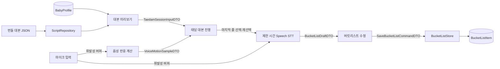
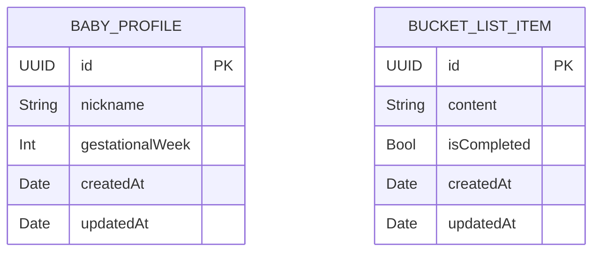
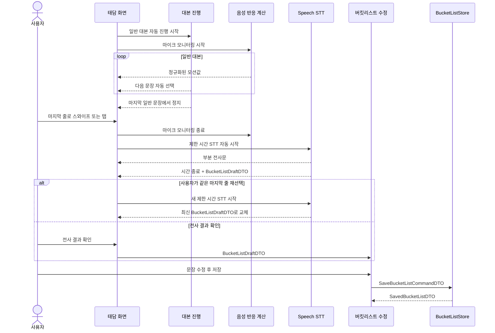

# 태담 정적 대본·실시간 음성 반응·버킷리스트 데이터 계약

- **상태**: review
- **작성일**: 2026-07-19
- **적용 범위**: 홈 → 대본 미리보기 → 대본 자동 진행 → 마지막 버킷리스트 STT → 사용자 수정 → 저장

> 이 문서는 태담 기능을 함께 개발할 때 사용하는 데이터 계약의 단일 기준이다.
> 정적 대본은 번들 JSON에 두고, 사용자가 최종 확인한 버킷리스트와 아기 프로필만 SwiftData에 저장한다.

## 1. 이번 변경의 핵심

태담 중 마이크 입력은 **즉석에서만 사용하고 폐기한다.** 앱은 태담 음성을 녹음 파일이나 SwiftData 기록으로 남기지 않는다.

| 데이터 | 사용·저장 위치 | 생명주기 |
|---|---|---|
| 대본 종류·메타데이터·문장 | 앱 번들 JSON | 앱과 함께 배포되는 읽기 전용 콘텐츠 |
| 현재 태명·임신 주차 | SwiftData `BabyProfile` | 사용자가 수정할 때까지 유지 |
| 대본 구간의 마이크 입력 | 메모리의 오디오 버퍼 | 배경 모션 계산 직후 폐기 |
| 버킷리스트 구간의 부분 전사 | 메모리 | STT 진행 중에만 유지 |
| 사용자가 수정·확정한 버킷리스트 | SwiftData `BucketListItem` | 사용자가 삭제할 때까지 유지 |

다음 데이터와 기능은 현재 범위에서 제거한다.

- 전체 태담 및 문장별 녹음 파일
- `TaedamRecord`, `TaedamRecording`
- 오디오 상대 경로, 녹음 길이, 합본 파일
- 발화 속도, 평균 음량, 주파수 이력과 같은 사후 피드백 데이터
- 녹음 일시 정지·재개 및 과거 녹음 재생

마이크 입력은 다음 두 목적으로만 사용한다.

1. **대본 구간**: 현재 사용자가 말하고 있음을 배경 모션으로 즉시 피드백한다.
2. **마지막 버킷리스트 구간**: Speech STT로 문장을 만들고 편집 화면에 전달한다.

---

## 2. 대본 JSON

### 저장 위치

```text
Siboya/Resources/Scripts/taedam-scripts.json
```

### 구조 원칙

- `category`는 여러 대본을 묶는 상위 분류다. 예: `아기사랑`.
- `title`은 개별 대본의 제목이다. 예: `상상력을 자극하는 이야기`.
- 일반 대본은 읽는 순서대로 구성된 `sentences: [String]`에 둔다.
- 버킷리스트 발화 문장은 일반 대본과 섞지 않고 `bucketListPrompt` 한 개로 둔다.
- `bucketListPrompt`는 화면에서 항상 전체 대본의 마지막 한 줄로 배치한다.
- 일반 대본은 자동으로 진행하지만 `bucketListPrompt` 직전에서는 자동 진행을 멈춘다.

### JSON 예시

```json
{
  "schemaVersion": 1,
  "scripts": [
    {
      "id": "baby-love-imagination-22w",
      "version": 1,
      "category": "아기사랑",
      "title": "상상력을 자극하는 이야기",
      "subtitle": "아빠의 목소리로 상상하는 첫 여행",
      "metadata": {
        "gestationalWeek": 22,
        "artworkAssetName": "script_baby_love_imagination_22w",
        "estimatedDurationSeconds": 180
      },
      "sentences": [
        "{{babyNickname}}아, 오늘도 엄마와 너를 생각했어.",
        "아빠와 함께 푹신한 구름 위로 올라가 보자.",
        "구름 아래에는 반짝이는 바다와 초록 숲이 보여.",
        "언젠가 우리 셋이 함께 이 풍경을 보러 가자."
      ],
      "bucketListPrompt": "{{babyNickname}}와 함께하고 싶은 일을 자유롭게 이야기해 주세요."
    }
  ]
}
```

### 필드 정의

| 경로 | 타입 | 필수 | 설명 |
|---|---|---:|---|
| `schemaVersion` | `Int` | O | JSON 문서 구조 버전 |
| `scripts` | `[Object]` | O | 앱에 포함된 대본 목록 |
| `scripts[].id` | `String` | O | 대본 식별자 |
| `scripts[].version` | `Int` | O | 대본 내용 개정 버전 |
| `scripts[].category` | `String` | O | 대본 카테고리 |
| `scripts[].title` | `String` | O | 대본 제목 |
| `scripts[].subtitle` | `String` | O | 대본 한 줄 설명 |
| `scripts[].metadata.gestationalWeek` | `Int` | O | 대본 대상 임신 주차 |
| `scripts[].metadata.artworkAssetName` | `String` | O | Assets 이미지 이름 |
| `scripts[].metadata.estimatedDurationSeconds` | `Int` | X | 예상 소요 시간 표시값 |
| `scripts[].sentences` | `[String]` | O | 자동 진행할 일반 대본 문장 |
| `scripts[].bucketListPrompt` | `String` | O | 마지막에 한 번만 표시할 자유 발화 안내 |

`{{babyNickname}}`은 `BabyProfile.nickname`으로 치환한다. JSON 원본은 수정하지 않는다.

### Swift 디코딩 모델

```swift
struct TaedamScriptDocument: Decodable, Sendable {
    let schemaVersion: Int
    let scripts: [TaedamScriptContent]
}

struct TaedamScriptContent: Decodable, Sendable {
    let id: String
    let version: Int
    let category: String
    let title: String
    let subtitle: String
    let metadata: ScriptMetadataContent
    let sentences: [String]
    let bucketListPrompt: String
}

struct ScriptMetadataContent: Decodable, Sendable {
    let gestationalWeek: Int
    let artworkAssetName: String
    let estimatedDurationSeconds: Int?
}
```

### JSON 검증 규칙

1. 지원하지 않는 `schemaVersion`이면 로딩을 실패시킨다.
2. `script.id + version` 조합은 중복될 수 없다.
3. `sentences`에는 한 개 이상의 일반 대본 문장이 있어야 한다.
4. 각 문장과 `bucketListPrompt`는 trim 후 비어 있을 수 없다.
5. `bucketListPrompt`는 별도 필드이므로 `sentences`에 중복해서 넣지 않는다.
6. `artworkAssetName`은 실제 Assets 리소스와 일치해야 한다.
7. 지원하지 않는 템플릿 변수가 있으면 테스트를 실패시킨다.

---

## 3. 화면과 데이터 흐름



마이크 버퍼에서 SwiftData나 파일 시스템으로 향하는 경로는 존재하지 않는다.

### 공통 DTO

```swift
struct ScriptSelectionDTO: Sendable {
    let scriptID: String
    let scriptVersion: Int
}

struct ScriptSentenceDTO: Identifiable, Equatable, Sendable {
    let index: Int
    let text: String

    var id: Int { index }
}

enum TaedamLineKindDTO: Equatable, Sendable {
    case script(sentenceIndex: Int)
    case bucketList
}

struct TaedamLineDTO: Identifiable, Equatable, Sendable {
    let index: Int
    let kind: TaedamLineKindDTO
    let text: String

    var id: Int { index }
}

struct ScriptPreviewDTO: Sendable {
    let scriptID: String
    let scriptVersion: Int
    let category: String
    let title: String
    let subtitle: String
    let gestationalWeek: Int
    let artworkAssetName: String
    let estimatedDurationSeconds: Int?
    let sentences: [ScriptSentenceDTO]
    let bucketListPrompt: String
}

struct TaedamSessionInputDTO: Sendable {
    let script: ScriptPreviewDTO
    let babyNickname: String
    let babyGestationalWeek: Int
}
```

세션은 `ScriptPreviewDTO.sentences`를 `.script` 줄로 만들고, 그 뒤에 `.bucketList` 줄을 정확히 한 개 추가한다. `.bucketList` 줄의 입력 텍스트는 처음에 빈 문자열이며 `bucketListPrompt`는 안내 문구로만 사용한다. STT 시작 여부는 문자열이 비었는지를 비교하지 않고 반드시 `TaedamLineKindDTO.bucketList`로 판단한다.

### 화면별 입출력

| 화면 | 받는 데이터 | 사용하는 데이터 | 다음으로 보내는 데이터 |
|---|---|---|---|
| 홈 | 없음 | `BabyProfileDTO`, 대본 카드 목록 | `ScriptSelectionDTO` |
| 대본 미리보기 | `ScriptSelectionDTO` | `ScriptPreviewDTO`, 권한 상태 | `TaedamSessionInputDTO` |
| 태담 대본 진행 | `TaedamSessionInputDTO` | 현재 `TaedamLineDTO`, 자동 진행 상태, 휘발성 음성 반응값 | 마지막 줄 선택 이벤트 |
| 버킷리스트 STT | `.bucketList` 줄과 마이크 입력 | 제한 시간, 부분·최종 전사문, 시도 횟수 | `BucketListDraftDTO` |
| 버킷리스트 수정 | `BucketListDraftDTO` | 편집 중인 문자열 | `SaveBucketListCommandDTO` |
| 완료·기록 | `SavedBucketListDTO` | 저장된 버킷리스트 | 상위 화면 완료 이벤트 |

---

## 4. 태담 진행 계약

### 상태

```swift
enum TaedamPhaseDTO: Equatable, Sendable {
    case ready
    case readingScript(index: Int)
    case awaitingBucketListTransition
    case transcribingBucketList(attempt: Int, remainingSeconds: Int)
    case reviewingBucketListDraft(attempt: Int)
    case editingBucketList
    case saving
    case completed(bucketListItemID: UUID)
    case failed(message: String)
}

struct TaedamSessionStateDTO: Equatable, Sendable {
    let phase: TaedamPhaseDTO
    let currentLine: TaedamLineDTO?
    let liveBucketListTranscript: String
    let normalizedVoiceMotion: Double
}
```

`normalizedVoiceMotion`은 `0...1` 범위의 화면용 값이다. 메모리에서만 전달하며 DTO 배열이나 SwiftData에 누적하지 않는다.

### 자동 대본 진행

```swift
protocol TaedamScriptProgressing: Sendable {
    var states: AsyncStream<TaedamSessionStateDTO> { get }

    func prepare(input: TaedamSessionInputDTO) async
    func start() async
    func selectLine(at index: Int) async throws
    func confirmBucketListDraft() async throws
    func cancel() async
}
```

- 일반 대본은 확정된 간격에 따라 한 문장씩 자동으로 이동한다.
- 사용자가 놓친 문장이 있으면 스와이프하거나 문장을 직접 탭해 원하는 문장으로 돌아갈 수 있다.
- 일반 문장을 수동으로 선택하면 자동 진행은 선택된 문장부터 이어진다.
- 마지막 일반 대본 다음에 시각적 경계와 `bucketListPrompt`를 둔다.
- 자동 진행은 마지막 일반 대본에서 멈추며 버킷리스트 STT를 자동 시작하지 않는다.
- 사용자가 경계를 지나 마지막 줄로 스와이프하거나 마지막 줄을 탭하면 음성 반응 모니터링을 먼저 종료한다.
- 현재 선택한 `TaedamLineDTO.kind`가 `.bucketList`이면 별도 시작 버튼 없이 제한 시간 STT를 자동 시작한다.
- STT가 이미 진행 중일 때 같은 줄을 다시 선택해도 중복 세션을 만들지 않는다.
- STT 제한 시간이 끝난 뒤 같은 `.bucketList` 줄을 다시 탭하면 새 STT 시도를 시작한다.
- 같은 인덱스 재탭은 선택값 변화가 아니므로 `selectedIndex`의 `onChange`에만 의존하지 않고 별도의 `selectLine(at:)` 이벤트로 전달한다.

### 실시간 음성 반응

```swift
struct VoiceMotionSampleDTO: Equatable, Sendable {
    let normalizedValue: Double
    let isVoiceActive: Bool
}

protocol VoiceMotionMonitoring: Sendable {
    var samples: AsyncStream<VoiceMotionSampleDTO> { get }

    func startMonitoring() async throws
    func stopMonitoring() async
}
```

- 대본을 읽는 동안 마이크 신호의 진동수 특성을 실시간으로 분석한다.
- 무음의 불안정한 주파수 값으로 화면이 튀지 않도록 음성 활성 여부를 먼저 판정한다.
- 화면은 정규화된 값만 받아 배경의 위치·진폭 모션에 사용한다.
- 입력 버퍼와 분석값은 화면 반영 직후 폐기한다.
- 앱은 원시 PCM, 주파수 샘플, 평균값을 파일이나 SwiftData에 저장하지 않는다.

> 음성이 있는지를 판정할 때는 신호 세기(RMS)를 보조값으로 사용할 수 있지만, 이 값도 저장하지 않는다.

### 마지막 버킷리스트 STT

이 문서에서 말하는 **STT 입력 시간**은 Speech가 마이크 입력을 받는 제한 시간이다. 오디오 파일을 생성하거나 보관하는 녹음 시간이 아니다.

```swift
struct BucketListDraftDTO: Equatable, Sendable {
    let rawTranscript: String
    var editedText: String
}

protocol BucketListTranscribing: Sendable {
    var partialTranscripts: AsyncStream<String> { get }

    func start(duration: Duration) async throws
    func finish() async throws -> BucketListDraftDTO
    func cancel() async
}
```

- Speech STT는 현재 선택된 줄의 `kind == .bucketList`일 때만 자동으로 시작한다.
- 일반 대본을 읽는 동안에는 STT를 실행하지 않는다.
- STT 시작 전 `VoiceMotionMonitoring.stopMonitoring()`으로 기존 오디오 tap을 제거한다. 두 서비스가 마이크 입력을 동시에 점유하지 않는다.
- 부분 전사문은 화면 표시용이며 저장하지 않는다.
- 확정된 제한 시간이 끝나면 STT를 자동 종료하고 최종 전사문을 `BucketListDraftDTO`로 만든다.
- STT가 끝난 뒤에는 `.reviewingBucketListDraft` 상태에서 결과를 보여준다.
- 사용자가 같은 `.bucketList` 줄을 다시 선택하면 새 STT 시도를 시작하고, 새 최종 결과로 저장 전 초안을 교체한다.
- 재시도 시에도 오디오 파일은 만들지 않으며 한 번에 하나의 Speech task만 실행한다.
- 사용자가 전사 결과를 확인하면 `confirmBucketListDraft()`를 통해 편집 단계로 이동한다.
- STT가 끝나면 마이크 입력과 인식 작업을 모두 종료한다.

---

## 5. SwiftData 스키마



### `BabyProfile`

| 필드 | 타입 | 설명 |
|---|---|---|
| `id` | `UUID` | unique |
| `nickname` | `String` | trim 후 빈 문자열 금지 |
| `gestationalWeek` | `Int` | 현재 임신 주차 |
| `createdAt` | `Date` | 생성 시각 |
| `updatedAt` | `Date` | 태명 또는 임신 주차 수정 시각 |

### `BucketListItem`

| 필드 | 타입 | 설명 |
|---|---|---|
| `id` | `UUID` | unique |
| `content` | `String` | 사용자가 수정·확정한 버킷리스트 문장 |
| `isCompleted` | `Bool` | 수행 여부, 생성 시 `false` |
| `createdAt` | `Date` | 생성 시각 |
| `updatedAt` | `Date` | 내용 또는 수행 상태 수정 시각 |

`BucketListItem`은 태담 녹음 기록과 연결되지 않는다. 현재 범위에는 녹음 기록 자체가 존재하지 않기 때문이다.

### SwiftData 모델 초안

```swift
import Foundation
import SwiftData

@Model
final class BabyProfile {
    @Attribute(.unique) var id: UUID
    var nickname: String
    var gestationalWeek: Int
    var createdAt: Date
    var updatedAt: Date

    init(
        id: UUID = UUID(),
        nickname: String,
        gestationalWeek: Int,
        createdAt: Date = .now,
        updatedAt: Date = .now
    ) {
        self.id = id
        self.nickname = nickname
        self.gestationalWeek = gestationalWeek
        self.createdAt = createdAt
        self.updatedAt = updatedAt
    }
}

@Model
final class BucketListItem {
    @Attribute(.unique) var id: UUID
    var content: String
    var isCompleted: Bool
    var createdAt: Date
    var updatedAt: Date

    init(
        id: UUID = UUID(),
        content: String,
        isCompleted: Bool = false,
        createdAt: Date = .now,
        updatedAt: Date = .now
    ) {
        self.id = id
        self.content = content
        self.isCompleted = isCompleted
        self.createdAt = createdAt
        self.updatedAt = updatedAt
    }
}
```

### 저장 계약

```swift
struct SaveBucketListCommandDTO: Sendable {
    let content: String
}

struct SavedBucketListDTO: Sendable {
    let bucketListItemID: UUID
}

struct UpdateBucketListCompletionCommandDTO: Sendable {
    let bucketListItemID: UUID
    let isCompleted: Bool
}

protocol BucketListStore: Sendable {
    func save(command: SaveBucketListCommandDTO) async throws -> SavedBucketListDTO
    func updateCompletion(
        command: UpdateBucketListCompletionCommandDTO
    ) async throws
}
```

저장 불변 조건은 다음과 같다.

1. `content`는 trim 후 비어 있을 수 없다.
2. STT 원문이 아니라 사용자가 수정·확정한 문장을 저장한다.
3. 새 항목은 `isCompleted == false`로 저장한다.
4. 부분 전사문과 오디오 데이터는 저장 명령에 포함하지 않는다.

---

## 6. 런타임 시퀀스



---

## 7. 구현 전 확정이 필요한 항목

1. **자동 진행 시작 시점**: 화면 진입 즉시 시작할지, 별도 시작 입력 또는 짧은 준비 시간을 둘지.
2. **문장별 자동 진행 간격**: 모든 문장을 같은 간격으로 넘길지, 문장 길이에 따라 달라질지.
3. **수동 이동 후 재개**: 일반 문장을 스와이프하거나 탭한 즉시 자동 진행을 재개할지, 별도 재개 입력을 받을지.
4. **진동수-모션 변환식**: 분석할 주파수 범위, 음성 활성 임계값, smoothing과 최대 모션 범위.
5. **버킷리스트 STT 제한 시간**: 한 번의 시도를 몇 초로 할지.
6. **재시도 화면 처리**: 새 시도를 시작하는 동안 이전 전사문을 유지할지 즉시 비울지.
7. **STT 실패 정책**: 빈 편집 화면에서 직접 입력하게 할지, 다시 말하기를 우선 제공할지.
8. **마이크 권한 책임**: 미리보기 화면과 태담 화면 중 어디서 권한 안내·요청을 담당할지.

위 항목은 확정 전까지 임의의 상수나 동작으로 구현하지 않는다.
