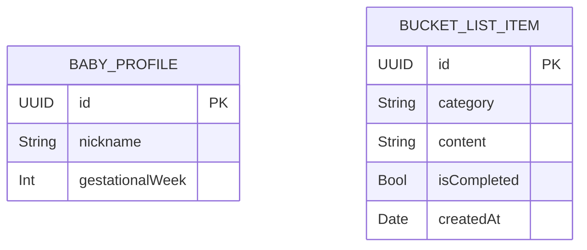
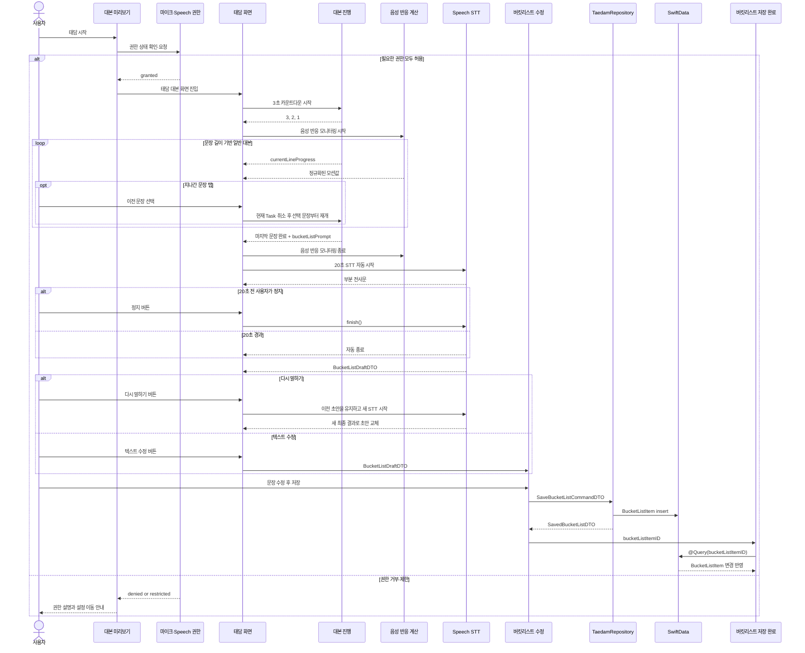

# 태담 정적 대본·실시간 음성 반응·버킷리스트 데이터 계약

- **상태**: review
- **작성일**: 2026-07-19
- **적용 범위**: 태담 탭 → 대본 미리보기 → 대본 자동 진행 → 마지막 버킷리스트 STT → 사용자 수정 → 저장 → 약속 탭(전체 조회·문장 수정·상태 변경·삭제)

> 이 문서는 태담 기능을 함께 개발할 때 사용하는 데이터 계약의 단일 기준이다.
> 정적 대본은 번들 JSON에 두고, 사용자가 최종 확인한 버킷리스트와 아기 프로필만 SwiftData에 저장한다.

## 1. 대본 JSON

### 저장 위치

```text
Siboya/Resources/Scripts/taedam-scripts.json
```

### 구조 원칙

- `category`는 여러 대본을 묶는 상위 분류다. 예: `아기사랑`.
- `title`은 개별 대본의 제목이다. 예: `상상력을 자극하는 이야기`.
- 일반 대본은 읽는 순서대로 구성된 `sentences: [String]`에 둔다.
- 버킷리스트 발화 문장은 일반 대본과 섞지 않고 `bucketListPrompt` 한 개로 둔다.
- `bucketListPrompt`는 화면에서 항상 전체 대본의 마지막 한 줄로 배치한다.
- 마지막 일반 대본이 끝나면 `bucketListPrompt`로 자동 전환하고 STT를 시작한다.

### JSON 예시

```json
{
  "scripts": [
    {
      "id": "8E442B98-7A08-4C67-9A61-E865848F1880",
      "version": 1,
      "category": "아기사랑",
      "title": "상상력을 자극하는 이야기",
      "subtitle": "아빠의 목소리로 상상하는 첫 여행",
      "metadata": {
        "targetGestationalWeek": 22,
        "artworkAssetName": "script_baby_love_imagination_22w",
        "estimatedDurationSeconds": 180
      },
      "sentences": [
        "{{babyNickname}}아, 오늘도 엄마와 너를 생각했어.",
        "아빠와 함께 푹신한 구름 위로 올라가 보자.",
        "구름 아래에는 반짝이는 바다와 초록 숲이 보여.",
        "언젠가 우리 셋이 함께 이 풍경을 보러 가자."
      ],
      "bucketListPrompt": "{{babyNickname}}와 함께하고 싶은 일을 자유롭게 이야기해 주세요."
    }
  ]
}
```

### 필드 정의

| 경로 | 타입 | 필수 | 설명 |
|---|---|---:|---|
| `scripts` | `[Object]` | O | 앱에 포함된 대본 목록 |
| `scripts[].id` | `String` (UUID) | O | 대본 UUID 식별자 |
| `scripts[].version` | `Int` | O | 대본 내용 개정 버전 |
| `scripts[].category` | `String` | O | 대본 카테고리 |
| `scripts[].title` | `String` | O | 대본 제목 |
| `scripts[].subtitle` | `String` | O | 대본 한 줄 설명 |
| `scripts[].metadata.targetGestationalWeek` | `Int` | O | 대본 대상 임신 주차 |
| `scripts[].metadata.artworkAssetName` | `String` | O | Assets 이미지 이름 |
| `scripts[].metadata.estimatedDurationSeconds` | `Int` | X | 대본 미리보기에 표시하는 예상 소요 시간 |
| `scripts[].sentences` | `[String]` | O | 자동 진행할 일반 대본 문장 |
| `scripts[].bucketListPrompt` | `String` | O | 마지막에 한 번만 표시할 자유 발화 안내 |

`{{babyNickname}}`은 `BabyProfile.nickname`으로 치환한다. JSON 원본은 수정하지 않는다. 치환은 `TaedamSessionInputDTO`가 만들어질 때 한 번 수행하며, 이후 진행 시간 계산과 화면 표시는 모두 치환된 텍스트를 사용한다.

### Swift 디코딩 모델

```swift
struct TaedamScriptDocument: Decodable, Sendable {
    let scripts: [TaedamScriptContent]
}

struct TaedamScriptContent: Decodable, Sendable {
    let id: UUID
    let version: Int
    let category: String
    let title: String
    let subtitle: String
    let metadata: ScriptMetadataContent
    let sentences: [String]
    let bucketListPrompt: String
}

struct ScriptMetadataContent: Decodable, Sendable {
    let targetGestationalWeek: Int
    let artworkAssetName: String
    let estimatedDurationSeconds: Int?
}
```

### JSON 검증 규칙

1. `script.id`는 유효한 UUID 문자열이어야 한다.
2. `script.id + version` 조합은 중복될 수 없다.
3. `sentences`에는 한 개 이상의 일반 대본 문장이 있어야 한다.
4. 각 문장과 `bucketListPrompt`는 trim 후 비어 있을 수 없다.
5. `bucketListPrompt`는 별도 필드이므로 `sentences`에 중복해서 넣지 않는다.
6. `artworkAssetName`은 실제 Assets 리소스와 일치해야 한다.
7. `{{ }}` 형태의 템플릿 변수 중 지원 목록(현재는 `babyNickname` 하나)에 없는 변수가 있으면 로딩을 실패시킨다. 유닛테스트는 번들 JSON에 대해 이 규칙을 사전에 검증한다.

---

## 2. 화면과 데이터 흐름

```mermaid
flowchart LR
    JSON[번들 대본 JSON] --> Repo[ScriptRepository]
    Repo --> Tab[태담 탭]
    Tab -->|ScriptSelectionDTO| Preview[대본 미리보기]
    Preview -->|TaedamSessionInputDTO| Session[태담 대본 진행]
    Mic[마이크 입력] -->|휘발성 버퍼| Motion[음성 반응 계산]
    Motion -->|VoiceMotionSampleDTO| Session
    Session -->|마지막 대본 완료| STT[제한 시간 Speech STT]
    Mic -->|휘발성 버퍼| STT
    STT -->|BucketListDraftDTO| Edit[버킷리스트 수정]
    Edit -->|SaveBucketListCommandDTO| Store[TaedamRepository]
    Store --> Bucket[(BucketListItem)]
    Store -->|SavedBucketListDTO| Complete[버킷리스트 저장 완료]
    Bucket -->|@Query by bucketListItemID| Complete
    Bucket -->|@Query 전체 목록| Promise[약속 탭]
    Promise -->|updateContent/toggleCompletion/delete| Store
```

마이크 버퍼에서 SwiftData나 파일 시스템으로 향하는 경로는 존재하지 않는다.

### 공통 DTO

```swift
struct ScriptSelectionDTO: Sendable {
    let scriptID: UUID
    let scriptVersion: Int
}

struct ScriptSentenceDTO: Identifiable, Equatable, Sendable {
    let index: Int
    let text: String

    var id: Int { index }
}

enum TaedamLineKindDTO: Equatable, Sendable {
    case script(sentenceIndex: Int)
    case bucketList
}

struct TaedamLineDTO: Identifiable, Equatable, Sendable {
    let index: Int
    let kind: TaedamLineKindDTO
    let text: String

    var id: Int { index }
}

struct ScriptPreviewDTO: Sendable {
    let scriptID: UUID
    let scriptVersion: Int
    let category: String
    let title: String
    let subtitle: String
    let targetGestationalWeek: Int
    let artworkAssetName: String
    let estimatedDurationSeconds: Int?
    let sentences: [ScriptSentenceDTO]
    let bucketListPrompt: String
}

struct TaedamSessionInputDTO: Sendable {
    let script: ScriptPreviewDTO
    let babyNickname: String
}
```

세션은 `ScriptPreviewDTO.sentences`를 `.script` 줄로 만들고, 그 뒤에 `.bucketList` 줄을 정확히 한 개 추가한다. `.bucketList` 줄의 입력 텍스트는 처음에 빈 문자열이며 `bucketListPrompt`는 안내 문구로만 사용한다. STT 시작 여부는 문자열이 비었는지를 비교하지 않고 반드시 `TaedamLineKindDTO.bucketList`로 판단한다.

### 화면별 입출력

| 화면 | 받는 데이터 | 사용하는 데이터 | 다음으로 보내는 데이터 |
|---|---|---|---|
| 태담 탭 | 없음 | `BabyProfileDTO`, 대본 카드 목록 | `ScriptSelectionDTO` |
| 대본 미리보기 | `ScriptSelectionDTO` | `ScriptPreviewDTO`, 권한 상태 | `TaedamSessionInputDTO` |
| 태담 대본 진행 | `TaedamSessionInputDTO` | 카운트다운, 현재 `TaedamLineDTO`, 문장 채우기 진행률, 휘발성 음성 반응값 | 버킷리스트 STT 자동 전환 |
| 버킷리스트 STT | `.bucketList` 줄과 마이크 입력 | 제한 시간, 부분·최종 전사문, 시도 횟수 | `BucketListDraftDTO` |
| 버킷리스트 수정 | `BucketListDraftDTO` | 편집 중인 문자열, `TaedamSessionInputDTO.script.category` | `SaveBucketListCommandDTO` |
| 버킷리스트 저장 완료 | `SavedBucketListDTO` | `@Query`로 관찰하는 `BucketListItem` | `onComplete: () -> Void` |
| 약속 탭 | 없음 | `@Query`로 관찰하는 전체 `BucketListItem` | `TaedamRepository.updateContent`/`toggleCompletion`/`delete` 호출 |

### 최종 화면 표시 계약

```swift
@Query private var bucketListItems: [BucketListItem]

init(bucketListItemID: UUID) {
    let id = bucketListItemID
    _bucketListItems = Query(
        filter: #Predicate<BucketListItem> { item in
            item.id == id
        }
    )
}
```

- 최종 화면은 방금 저장한 `bucketListItemID`로 `@Query`를 구성해 해당 `BucketListItem`을 관찰하고 버킷리스트 셀만 보여준다.
- `@Query`가 빈 배열을 반환하면 저장된 항목을 찾을 수 없는 상태로 처리한다.
- 셀에는 대본 카테고리, 버킷리스트 내용과 수행 상태처럼 `BucketListItem`에서 직접 가져온 정보만 표시한다.
- 태담 점수, 발화 평가, 그래프, 주파수·음량 수치, 녹음 시간과 오디오 재생 UI는 표시하지 않는다.
- 대본을 완료했다는 사실로 별도의 태담 피드백 데이터나 요약 모델을 생성하지 않는다.
- 상위 화면으로는 데이터 없는 완료 콜백만 전달한다: `var onComplete: () -> Void`. 상위 화면은 이 콜백을 받으면 현재 화면을 닫기만 하며, 저장된 `bucketListItemID`를 이용해 다른 화면으로 이동하거나 강조 표시하지 않는다.

---

## 3. 태담 진행 계약

### 권한 확인

- 대본 미리보기에서 사용자가 태담 시작을 선택하면, 태담 대본 화면으로 진입하기 직전에 마이크와 Speech 인식 권한을 확인한다.
- 권한 상태는 태담 진입을 시도할 때마다 다시 확인한다.
- `.notDetermined`이면 시스템 권한 요청을 표시하고, 필요한 권한이 모두 허용된 뒤에만 태담 대본 화면으로 진입한다.
- `.denied` 또는 `.restricted`이면 반복해서 시스템 팝업을 요청하지 않고, 권한이 필요한 이유와 설정 이동 안내를 보여준다.
- 권한이 확정되기 전에는 3초 카운트다운을 시작하지 않는다.

### 상태

```swift
enum TaedamPhaseDTO: Equatable, Sendable {
    case ready
    case countingDown(remainingSeconds: Int)
    case readingScript(index: Int)
    case transcribingBucketList(attempt: Int, remainingSeconds: Int)
    case reviewingBucketListDraft(attempt: Int)
    case editingBucketList
    case saving
    case completed(bucketListItemID: UUID)
    case failed(message: String)
}

struct TaedamSessionStateDTO: Equatable, Sendable {
    let phase: TaedamPhaseDTO
    let currentLine: TaedamLineDTO?
    let currentLineProgress: Double
    let liveBucketListTranscript: String
    let normalizedVoiceMotion: Double
}
```

`currentLineProgress`와 `normalizedVoiceMotion`은 `0...1` 범위의 화면용 값이다. 메모리에서만 전달하며 DTO 배열이나 SwiftData에 누적하지 않는다.

### 자동 대본 진행

```swift
protocol TaedamScriptProgressing: Sendable {
    var states: AsyncStream<TaedamSessionStateDTO> { get }

    func prepare(input: TaedamSessionInputDTO) async
    func start() async
    func selectLine(at index: Int) async throws
    func confirmBucketListDraft() async throws
    func cancel() async
}
```

- 태담 대본 화면에 진입하면 `3`, `2`, `1`을 표시하는 3초 카운트다운을 자동 시작한다.
- 카운트다운이 끝나면 첫 번째 일반 대본의 `currentLineProgress`를 `0`으로 두고 대본 스트림을 시작한다.
- `{{babyNickname}}`이 치환된 표시 텍스트 기준으로, 공백을 제외한 `Character` 수를 기준으로 `clamp(문자 수 / 4.0, 2.5, 10.0)`초로 계산한다. `4.0`, `2.5`, `10.0`은 UI 테스트 후 조정할 수 있는 타이밍 정책값이다.
- 화면은 전체 문장을 기본 색으로 미리 배치하고 `currentLineProgress`에 따라 전경색 텍스트를 마스크해 노래방 가사처럼 채운다. 진행 중에 텍스트 레이아웃은 바뀌지 않는다.
- 현재 문장의 진행률이 `1`이 되면 다음 일반 문장을 자동으로 시작한다.
- 문장 이동을 위한 스와이프는 제공하지 않는다.
- 사용자가 이미 지나간 일반 문장을 탭하면 현재 진행 Task를 취소하고, 선택한 문장의 진행률을 `0`으로 초기화한 후 그 문장부터 즉시 자동 진행을 재개한다. 3초 카운트다운은 반복하지 않는다.
- 미래 문장과 `.bucketList` 줄은 수동으로 선택하지 않는다.
- 마지막 일반 문장의 진행률이 `1`이 되면 `bucketListPrompt`로 자동 전환하고 STT를 시작한다. 별도의 스와이프, 탭, 시작 버튼은 필요하지 않다.
- 자동 진행 Task는 한 번에 하나만 유지하며, 문장 재선택·화면 종료·STT 전환 시 기존 Task를 취소한다.

### 실시간 음성 반응

```swift
struct VoiceMotionSampleDTO: Equatable, Sendable {
    let normalizedValue: Double
    let isVoiceActive: Bool
}

protocol VoiceMotionMonitoring: Sendable {
    var samples: AsyncStream<VoiceMotionSampleDTO> { get }

    func startMonitoring() async throws
    func stopMonitoring() async
}
```

- 음성 반응 모션은 사용자가 현재 말하고 있음을 즉시 피드백하는 보조 UI이며, 발화 품질을 평가하지 않는다.
- 대본을 읽는 동안 마이크 버퍼의 RMS를 dB로 변환하고 `target = clamp((rmsDB + 55) / 40, 0, 1)`로 정규화한다. `-55 dB`와 `-15 dB`는 실기기 테스트 후 조정할 수 있는 초기 기준이다.
- 모션은 빠르게 반응하고 천천히 가라앉도록 `smoothed = previous + alpha * (target - previous)`를 사용한다. `target > previous`이면 `alpha = 0.35`, 그 외에는 `alpha = 0.12`를 초기값으로 사용한다.
- 음성 활성 판정은 히스테리시스를 두어 정규화값이 `0.15` 이상이면 활성화하고, `0.08` 이하가 250밀리초 이상 유지될 때 비활성화한다.
- 화면은 `eased = smoothed * smoothed * (3 - 2 * smoothed)`를 사용해 `scale = 1 + 0.08 * eased`, `shapeDeformation = 0.12 * eased`로 배경 View의 크기와 모양을 변화시킨다.
- 입력 버퍼와 분석값은 화면 반영 직후 폐기한다.
- 앱은 원시 PCM, RMS·dB 샘플, 평균값을 파일이나 SwiftData에 저장하지 않는다.

> RMS, dB, 활성 여부와 모션값은 모두 휘발성으로 사용하고 저장하지 않는다.

### 마지막 버킷리스트 STT

이 문서에서 말하는 **STT 입력 시간**은 Speech가 마이크 입력을 받는 제한 시간이다. 오디오 파일을 생성하거나 보관하는 녹음 시간이 아니다.

```swift
struct BucketListDraftDTO: Equatable, Sendable {
    let rawTranscript: String
    var editedText: String
}

protocol BucketListTranscribing: Sendable {
    var partialTranscripts: AsyncStream<String> { get }

    func start(duration: Duration) async throws
    func finish() async throws -> BucketListDraftDTO
    func cancel() async
}
```

- Speech STT는 마지막 일반 대본이 완료되어 현재 줄이 `.bucketList`로 전환될 때 자동으로 시작한다.
- 일반 대본을 읽는 동안에는 STT를 실행하지 않는다.
- STT로 전환하기 전에 음성 반응 모니터의 `stopMonitoring()`을 완료해 기존 input tap을 제거한 후, STT용 input tap을 설치한다.
- 한 번의 STT 최대 입력 시간은 20초로 한다.
- STT 진행 중에는 정지 버튼을 항상 표시한다. 사용자가 20초 전에 정지하면 `finish()`로 현재 인식 작업을 종료하고 결과를 확정한다.
- 부분 전사문은 화면 표시용이며 저장하지 않는다.
- 20초 제한 시간이 끝나면 STT를 자동 종료하고 최종 전사문을 `BucketListDraftDTO`로 만든다.
- STT가 끝난 뒤에는 `.reviewingBucketListDraft` 상태에서 결과를 보여준다.
- `.reviewingBucketListDraft`에서는 **다시 말하기**와 **텍스트 수정** 버튼을 모두 제공한다.
- 다시 말하기를 선택하면 새 STT 시도를 시작하되 이전 `BucketListDraftDTO`를 비우지 않는다. 새 발화가 끝나 최종 전사문이 확정되면 이전 초안을 새 초안으로 전체 교체한다.
- 텍스트 수정을 선택하면 현재 초안을 `editedText`로 사용하는 편집 단계로 이동한다. 전사문이 비어 있거나 인식에 실패해도 빈 편집 화면에서 직접 입력할 수 있다.
- 재시도 시에도 오디오 파일은 만들지 않으며 한 번에 하나의 Speech task만 실행한다.
- STT가 끝나면 마이크 입력과 인식 작업을 모두 종료한다.

---

## 4. SwiftData 스키마



### `BabyProfile`

| 필드 | 타입 | 설명 |
|---|---|---|
| `id` | `UUID` | unique |
| `nickname` | `String` | trim 후 빈 문자열 금지 |
| `gestationalWeek` | `Int` | 현재 임신 주차 |

### `BucketListItem`

| 필드 | 타입 | 설명 |
|---|---|---|
| `id` | `UUID` | unique |
| `category` | `String` | 버킷리스트가 생성된 대본의 카테고리 |
| `content` | `String` | 사용자가 수정·확정한 버킷리스트 문장 |
| `isCompleted` | `Bool` | 수행 여부, 생성 시 `false` |
| `createdAt` | `Date` | 생성 시각 |

`category`는 버킷리스트 저장 시점의 대본 카테고리를 그대로 보존하는 스냅샷이다. `BucketListItem`은 태담 녹음 기록과 연결되지 않는다. 현재 범위에는 녹음 기록 자체가 존재하지 않기 때문이다.

### SwiftData 모델 초안

```swift
import Foundation
import SwiftData

@Model
final class BabyProfile {
    @Attribute(.unique) var id: UUID
    var nickname: String
    var gestationalWeek: Int

    init(
        id: UUID = UUID(),
        nickname: String,
        gestationalWeek: Int
    ) {
        self.id = id
        self.nickname = nickname
        self.gestationalWeek = gestationalWeek
    }
}

@Model
final class BucketListItem {
    @Attribute(.unique) var id: UUID
    var category: String
    var content: String
    var isCompleted: Bool
    var createdAt: Date

    init(
        id: UUID = UUID(),
        category: String,
        content: String,
        isCompleted: Bool = false,
        createdAt: Date = .now
    ) {
        self.id = id
        self.category = category
        self.content = content
        self.isCompleted = isCompleted
        self.createdAt = createdAt
    }
}
```

### 저장 계약

```swift
struct SaveBucketListCommandDTO: Sendable {
    let category: String
    let content: String
}

struct SavedBucketListDTO: Sendable {
    let bucketListItemID: UUID
}

struct UpdateBucketListContentCommandDTO: Sendable {
    let bucketListItemID: UUID
    let content: String
}

protocol TaedamRepository: Sendable {
    func fetchBabyProfile() throws -> BabyProfile?

    func save(command: SaveBucketListCommandDTO) async throws -> SavedBucketListDTO
    func updateContent(
        command: UpdateBucketListContentCommandDTO
    ) async throws
    func toggleCompletion(bucketListItemID: UUID) async throws
    func delete(bucketListItemID: UUID) async throws
}
```

`TaedamRepository`는 태담 세션 흐름과 약속 탭이 함께 쓰는 기반 레이어다. 화면이 목록을 관찰할 때는 `@Query`를 직접 쓰고, 데이터를 변경할 때만 이 프로토콜을 거친다.

`toggleCompletion`은 `isCompleted` 값을 화면에서 계산해 보내지 않고 `bucketListItemID`만 받아 저장된 현재값을 뒤집는다. 화면이 `@Query`로 읽은 값과 실제 갱신 시점 사이에 간극이 있어(`async throws` 호출), 값을 계산해서 보내면 연속 탭 시 최신 상태를 놓치고 같은 값을 중복 전송할 수 있기 때문이다.

저장·수정 불변 조건은 다음과 같다.

1. `category`는 `TaedamSessionInputDTO.script.category`에서 가져오며 trim 후 비어 있을 수 없다. 생성 이후에는 어떤 화면에서도 수정하지 않는다.
2. `content`는 `save`와 `updateContent` 모두에서 trim 후 비어 있을 수 없다.
3. `save`는 STT 원문이 아니라 사용자가 수정·확정한 문장을 저장한다.
4. 새 항목은 `isCompleted == false`로 저장한다.
5. 부분 전사문과 오디오 데이터는 저장 명령에 포함하지 않는다.

---

## 5. 런타임 시퀀스



---

## 6. 구현 결정 및 추가 합의 항목

### 확정 사항

1. **자동 진행 시작 시점**: 태담 대본 화면 진입 후 3초 카운트다운을 실행하고 첫 문장부터 자동 진행한다.
2. **문장별 자동 진행 간격**: 문장의 공백을 제외한 `Character` 수에 따라 진행 시간을 계산하고, `0...1` 진행률로 노래방 가사처럼 텍스트를 채우는 UI를 사용한다.
3. **수동 이동 후 재개**: 스와이프 이동은 제공하지 않는다. 지나간 문장을 탭하면 그 문장의 처음부터 자동 진행을 즉시 재개한다. 마지막 일반 문장이 끝나면 사용자 입력 없이 버킷리스트 STT로 전환한다.
4. **음성-모션 변환식**: RMS dB를 `0...1`로 정규화하고 attack·release smoothing과 easing을 적용한다. 결과값은 `scale = 1 + 0.08 * eased`, `shapeDeformation = 0.12 * eased`로 배경 View의 크기·모양 변화에만 사용한다.
5. **버킷리스트 STT 제한 시간**: 기본 최대 시간은 20초로 하며, 사용자가 이보다 먼저 끝낼 수 있는 정지 버튼을 제공한다.
6. **재시도 화면 처리**: 다시 말하기 중에는 이전 초안을 유지하고, 새 최종 전사문이 나오면 이전 초안을 전체 교체한다.
7. **STT 실패·후속 행동**: 결과 화면에 다시 말하기와 텍스트 수정 버튼을 함께 제공한다. 전사 결과가 비어 있어도 편집 화면에서 직접 입력할 수 있다.
8. **마이크 권한 책임**: 대본 미리보기에서 태담 시작을 선택한 시점에 권한을 확인·요청하고, 필요한 권한이 모두 허용된 후 대본 화면으로 진입한다.

### 추가 팀 합의 필요

- **무음 기반 STT 자동 종료**: 사용자의 발화 시작을 한 번 탐지한 뒤 연속 무음이 일정 시간 유지되면 STT를 자동 종료하는 방식은 팀 합의 후 적용한다. 후보 정책은 `최소 2초 입력 + 발화 탐지 후 1.5초 연속 무음`이며, 20초 하드 제한과 수동 정지 버튼은 항상 유지한다.
- 팀 합의 전까지는 무음으로 STT를 자동 종료하지 않고, 20초 타임아웃과 사용자의 정지 입력만 사용한다.
