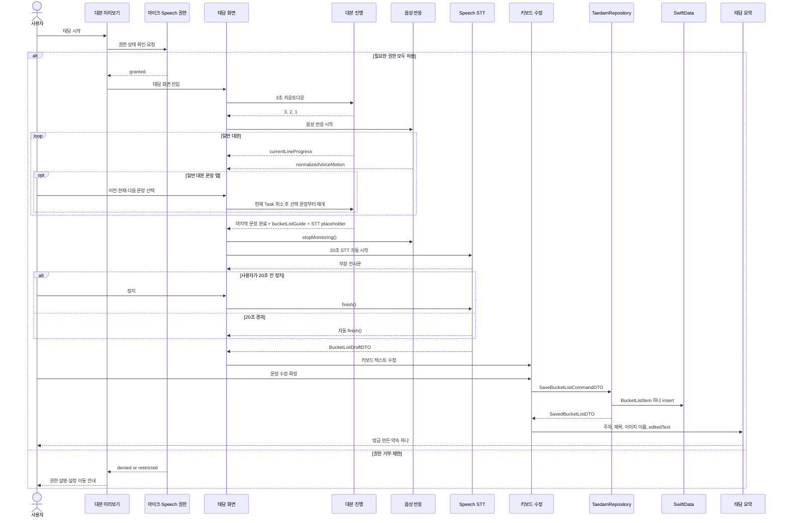

# 태담 진행 기능 스펙

- **상태**: approved
- **작성일**: 2026-07-21
- **적용 범위**: 대본 미리보기, 권한 확인, 3초 카운트다운, 대본 자동 진행, 버킷리스트 STT, 키보드 수정·저장, 태담 요약
- **공통 계약**: [태담 공통 데이터 계약](./taedam-common-contracts.md)

## 1. 목적

사용자가 준비 시간 후 대본을 자연스럽게 따라 읽고, 마지막에 아기와 함께하고 싶은 일을 말한 뒤 키보드로 최종 문장을 확정하게 한다. 완료된 태담 하나당 버킷리스트 하나만 저장하고 요약 화면에도 해당 항목 하나만 보여준다.

## 2. 화면 구성과 책임

| 단계 | 입력 | 주요 동작 | 다음 단계 |
|---|---|---|---|
| 대본 미리보기 | `ScriptSelectionDTO` | 대본 요약 표시, 권한 확인 | `TaedamSessionInputDTO` |
| 카운트다운·대본 진행 | `TaedamSessionInputDTO` | 3초 카운트다운, 문장 채우기, 음성 반응 모션 | 버킷리스트 STT 자동 전환 |
| 버킷리스트 STT | `.bucketList` 줄 | 최대 20초 전사, 수동 정지 | `BucketListDraftDTO` |
| 버킷리스트 텍스트 수정 | `BucketListDraftDTO` | 키보드 수정·확정 | `SaveBucketListCommandDTO` |
| 태담 요약 | 선택한 태담 정보와 최종 `editedText` | 방금 만든 약속 하나 표시 | `onComplete: () -> Void` |

## 3. 권한 확인

- 대본 미리보기에서 사용자가 태담 시작을 선택할 때마다 마이크와 Speech 인식 권한을 확인한다.
- `.notDetermined`이면 시스템 권한 요청을 표시한다.
- 필요한 권한이 모두 허용된 뒤에만 태담 대본 화면으로 진입한다.
- `.denied` 또는 `.restricted`이면 시스템 팝업을 반복 요청하지 않고 설정 이동 안내를 보여준다.
- 권한이 확정되기 전에는 3초 카운트다운을 시작하지 않는다.

## 4. 대본 준비·자동 진행

- `TaedamSessionInputDTO`를 만들 때 대본의 `{{babyNickname}}`을 현재 `BabyProfile.nickname`으로 한 번 치환한다.
- 태담 화면 진입 후 `3`, `2`, `1`을 표시하는 3초 카운트다운을 자동 시작한다.
- 카운트다운이 끝나면 첫 번째 일반 문장의 `currentLineProgress`를 `0`으로 두고 대본 스트림을 시작한다.
- 문장 진행 시간은 치환된 표시 텍스트의 공백을 제외한 `Character` 수로 계산한다.

```text
durationSeconds = clamp(characterCount / 4.0, 2.5, 10.0)
```

`4.0`, `2.5`, `10.0`은 UI 테스트 후 조정할 수 있는 타이밍 정책값이다.

- 전체 문장을 기본 색으로 미리 배치하고, `currentLineProgress`에 따라 각 글자의 전경색을 선형 보간해 노래방 가사처럼 채운다.
- 글자 채움 애니메이션은 기본 0.08초이며, 비활성 글자 opacity는 0.15를 사용한다.
- 대본 본문과 STT 플레이스홀더는 SF Pro 28pt Bold, line height 42pt, letter spacing 0.38pt를 사용한다.
- `KaraokeText`의 채움 표현과 일반 대본문장의 흐림·투명도 표현은 서로 독립적으로 유지한다.
- 텍스트 레이아웃은 진행 중 바뀌지 않는다.
- 진행률이 `1`이 되면 다음 문장을 자동으로 시작한다.
- 대본은 세로 `ScrollView`로 감싸 사용자가 이전·다음 문장을 자유롭게 탐색할 수 있게 한다.
- 대본 진행 중이거나 `.bucketList` 상태일 때 사용자가 이전·현재·다음 일반 대본 문장을 탭하면 현재 진행 Task를 취소하고, 선택한 문장의 진행률을 `0`으로 초기화한 뒤 그 문장부터 즉시 재개한다.
- 문장을 다시 선택할 때 3초 카운트다운은 반복하지 않는다.
- `.bucketList` 줄은 수동으로 선택하지 않는다.
- 자동 진행 Task는 한 번에 하나만 유지하고, 문장 재선택·화면 종료·STT 전환 시 취소한다.

## 5. 실시간 음성 반응

음성 반응 모션은 사용자가 현재 말하고 있음을 즉시 피드백하는 보조 UI이며 발화 품질을 평가하지 않는다.

1. 마이크 버퍼의 RMS를 dB로 변환한다.
2. `target = clamp((rmsDB + 55) / 40, 0, 1)`로 정규화한다.
3. `smoothed = previous + alpha * (target - previous)`로 smoothing한다.
4. `target > previous`이면 `alpha = 0.35`, 그 외에는 `alpha = 0.12`를 초기값으로 사용한다.
5. `target >= 0.15`이면 음성 활성, `target <= 0.08`이 250밀리초 유지되면 비활성으로 판정한다.
6. `eased = smoothed * smoothed * (3 - 2 * smoothed)`를 계산한다.
7. 배경 View에 `scale = 1 + 0.08 * eased`, `shapeDeformation = 0.12 * eased`를 적용한다.

`-55 dB`, `-15 dB`, smoothing 계수와 모션 크기는 실기기 UI 테스트 후 조정할 수 있다. 입력 버퍼와 분석값은 화면 반영 직후 폐기한다.

## 6. 버킷리스트 STT·텍스트 수정

- 마지막 일반 문장의 진행률이 `1`이 되면 `bucketListGuide` 안내 카드와 `bucketListPrompt` STT 플레이스홀더로 자동 전환한다.
- `bucketListGuide`는 STT 플레이스홀더 직전에 보조 텍스트로 표시하며 예시 답변은 표시하지 않는다.
- 음성 반응 모니터의 `stopMonitoring()`을 완료해 기존 input tap을 제거한 뒤 STT용 input tap을 설치한다.
- STT는 별도의 스와이프, 탭 또는 시작 버튼 없이 자동 시작한다.
- 한 번의 STT 최대 입력 시간은 20초다.
- STT 진행 중 정지 버튼을 항상 표시한다. 정지 버튼은 `finish()`로 현재 전사 결과를 확정한다.
- 20초가 경과하면 자동으로 `finish()`한다.
- 부분 전사문은 화면 표시용으로만 사용하고 저장하지 않는다.
- 첫 부분 전사문이 들어오면 `bucketListPrompt` 플레이스홀더를 제거하고 전사문으로 덮어쓴다.
- `.bucketList` 상태에서 일반 대본문장을 선택하면 진행 중인 STT를 중단하고 선택한 문장부터 대본을 재개한다.
- 재개한 대본이 끝나 다시 `.bucketList`에 도달하면 STT 진입 이벤트를 다시 전달한다.
- 최종 전사문을 `BucketListDraftDTO`로 만든 뒤 `.reviewingBucketListDraft`로 전환한다.
- 전사 결과 수정 수단은 **키보드 텍스트 수정 하나만** 제공한다.
- **다시 말하기, STT 재시도, 재발화 버튼은 제공하지 않는다.**
- 전사문이 비어 있거나 인식에 실패해도 빈 편집 화면에서 키보드로 직접 입력할 수 있다.
- 키보드 편집 화면은 `rawTranscript`를 초기 `editedText`로 사용하고, 사용자가 최종 확정한 `editedText`만 저장 명령에 넣는다.
- STT가 끝나면 마이크 입력과 인식 Task를 모두 종료한다.

### 무음 기반 자동 종료

이 기능은 팀 합의 전까지 구현하지 않는다. 현재는 20초 타임아웃과 사용자의 정지 입력만 사용한다.

후보 정책은 발화를 한 번 탐지한 뒤 `최소 2초 입력 + 1.5초 연속 무음`을 만족하면 종료하는 방식이다. 적용하더라도 20초 제한과 정지 버튼은 유지한다.

## 7. 저장·태담 요약

- `SaveBucketListCommandDTO.category`는 현재 `TaedamSessionInputDTO.script.category`의 스냅샷이다.
- `SaveBucketListCommandDTO.content`는 사용자가 키보드로 최종 확정한 문장이다.
- 세션은 `save` 성공 후 즉시 `.completed(bucketListItemID:)`로 전환한다.
- 한 세션에서 저장을 두 번 이상 요청하지 않는다.
- 저장 성공 후 요약 화면에는 `TaedamSessionInputDTO.script`의 `targetGestationalWeek`, `title`,
  `artworkAssetName`과 사용자가 확정한 `editedText`를 직접 전달한다.
- 요약 화면은 일회성 화면이므로 SwiftData 또는 Repository를 다시 조회하지 않는다.
- 요약 셀에는 해당 세션에서 최종 확정한 약속 하나만 표시한다.
- 태담 점수, 발화 평가, 그래프, 주파수·음량 수치, 녹음 시간과 오디오 재생 UI는 표시하지 않는다.
- 상위 화면에는 `onComplete: () -> Void`만 전달한다. 상위 화면은 완료 시 현재 화면을 닫고 별도 항목을 강조하거나 추가 이동하지 않는다.

```swift
TaedamResultView(
    targetGestationalWeek: sessionInput.script.targetGestationalWeek,
    title: sessionInput.script.title,
    artworkAssetName: sessionInput.script.artworkAssetName,
    bucketListContent: editedText,
    onComplete: onComplete
)
```

## 8. 런타임 시퀀스



## 9. 핵심 불변 조건

1. STT는 하나의 태담 세션에서 한 번만 시작하며 재발화 수정 경로를 제공하지 않는다.
2. STT 결과는 키보드 수정 후에만 저장할 수 있다.
3. 하나의 세션은 `BucketListItem`을 하나만 생성한다.
4. 태담 요약 화면은 해당 세션이 만든 `BucketListItem` 하나만 표시한다.
5. 녹음 파일, 전사 이력, 모션 샘플과 태담 평가 데이터는 저장하지 않는다.
